# Week3 (Draft)

### ข้อดีของ Direct Communication กับ Internet Communication
- **ความเสถียร** : ความเสถียร Internet มีความเสถียรมากกว่า เพราะว่าในปัจจุบันเราสามารถมีได้หลาย Router หลาย Hub (Cloud) ทำให้สามารถไปได้หลาย Link ไม่จำเป็นต้องไปเส้นทางเดียวกัน
  **ยกเว้น** ต่อ Internet แบบเส้นตรงเส้นเดียว แบบนี้ Internet สามารถล่มได้
- **ความเร็ว** : ขึ้นอยู่กับว่าใช้แบบไหน ถ้าใช้สายต่อตรงแบบเร็วๆอย่า Lan ที่มีความเร็วมากๆ 1 Gbps ก็จะไวกว่า Internet เพราะไม่ต้องแชร์กับใคร
- **ความปลอดภัย** : แน่นอนว่า Direct ปลอดภัยกว่า เพราะต่อตรงๆไม่ผ่านไปไหนเลย แต่ Internet ก็มีวิธีทำให้ปลอดภัยนะ
- **ความซับซ้อน** :
  - Internet ต้องใช้ซอฟแวร์ในการเชื่อมต่อที่ซับซ้อนกว่าเพราะว่าต้องใช้พวก Communication Library (Full TCP/IP Stack)
  - Direct ใช้แค่ serial protocol มันต้องการแค่ Hardware ธรรมดาก็สามารถเชื่อมต่อได้แล้ว แต่เช่นเดียวกันมันก็จะเชื่อมต่อ Internet ไม่ได้

  _Full TCP/IP Stack_ : Set of networking protocol ประกอบด้วยหลายๆ layer เดี๋ยวจะกล่าวต่อไป

- **สถานที่** : Internet เวลาจะเชื่อมต่ออุปกรณ์กันไม่จำเป็นต้องอยู่ใกล้กันตราบใดที่ยังมี Internet ก็สามารถเชื่อมต่อกันได้
- **reliability** : Internet เนื่องจากมันมีหลาย Device ที่ต้องผ่าน ทำให้อาจจะเกิด Delay ที่สูงหน่อย

### แล้วอะไรเป็น Protocol ที่จะใช้ในการแสดงผลเว็บละ?

> **Browser** เป็นเหมือน Client Software ที่ติดต่อกับ Webserver แล้วมันรู้ได้ไงว่ามันจะเอาอะไรมาแสดง?

> แล้ว **Webserver** รู้ได้ไงว่า Client ต้องการอะไร?

**HTTP** - HyperText Transfer Protocol

**HTTPS** - Hyper Text Transfer Protocol with Secure Sockets Layer (SSL)

**TCP** - Transmission Control Protocol

**IP** - Internet Protocol

> ที่กล่าวมาทั้งหมดนี้เป็น Protocol หมดเลย เรามีหลาย Level ของ Protocol เพื่อช่วยกันให้ Internet สามารถทำงานได้

> ส่วน Protocol ที่ Fetch เอาเนื้อหาจาก Webserver มาแสดงผลเป็นเว็บไซต์ คือ **HTTP/HTTPS**

> **Socket** มันทำงานอยู่บน TCP

> **IP** ถ้าจะต่อ Internet ต้องใช้ตัวนี้ในการเชื่อมต่อ

###HTTP, TCP, IP. How it's work?

## Traditional Internet Application

### World Wide Web (www)

เราไม่ได้เรียกใช้ Protocol โดยตรง Web bowser เป็นตัวเรียกใช้งาน Protocol ต่างๆ

***www*** มันก็มีหลาย Standard ที่จะใช้ในการแสดงผลเว็บ 1 เว็บ ได้แก่
  * HTTP - Protocol
  * HTML - ภาษาที่ใช้แสดงผลเว็บไซต์
  * URL

### HTTP GET Requests/Responses

คำสั่งพื้นฐานในการ GET ค่าผ่าน HTTP

  ``` _GET /index.html HTTP/1.1_```

เมื่อ Client ส่งคำสั่ง GET ไปยัง Server ตัว Server ก็จะตอบกลับบางอย่างกลับมา เช่น

```HTML
HTTP/1.0 200 OK
Server: Apache/1.3.37
Content-Length: 221
Content-Type: text/html
<HTML>
:
</HTML>
```
แล้ว Browser ก็จะ render ออกมาให้เราดู

#### Wireshark
  บางครั้งที่เราต้อง Link ไปที่ต่างๆ นอกเครื่อง Wireshark จะ Monitor ทุกอย่างไว้ให้เราว่ามีการเข้าออกอะไรอย่างไรบ้าง

> คำสั่งที่ใช้ในการมองหา IP ของทุก OS คือ 'nslookup www.xxxx.com'

## Packet Switching, Layer Models and Protocol Suites

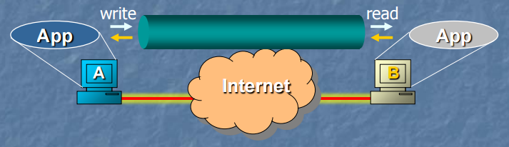
จากภาพ A จะส่งข้อมูลไปหา B ก็ต้องผ่าน Protocol ซึ่ง Protocol ส่วนใหญ่จะเป็น Software การเชื่อมต่อผ่าน Internet ของ A ไป B จะต้องเหมือนกับการต่อกันโดยตรง แต่การที่จะส่งข้อมูลโดยตรงผ่าน Internet เลยนั้นทำไม่ได้ ต้องใช้ protocol เข้ามาช่วย

### Dedicated circuits
- เหมือนการต่อไปตรงๆ แบบต่อหมดทุกเครื่อง ธรรมดาไม่มีอะไร ถ้าต้องการจะ connect ไปไหนก็ต่อไปตรงๆเลย
  - ปลอดภัยมาก เพราะต่อเข้าตรงๆ
  - แต่ถ้าต้องการจะเปลี่ยนเครื่องที่เชื่อมต่อ ต้องทำการดึงปลั๊กออกแล้วก็เสียบเข้ากับเครื่องใหม่
  - ในอดีตต้องมีคนเปลี่ยนสาย Link ให้

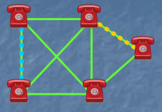

### Circuit Switching
- connect ไปยัง central switch
- ในอดีต central switch จะมีคนคอยดูให้ว่าจะโทรไปหาเบอร์อะไร ขั้นแรกต้องบอก Operator ก่อนว่าจะโทรไปหาใคร แล้ว Operator ก็จะต่อไปยังเบอร์ที่เราต้องการให้ แล้วจึงสามารถคุยกันได้
  - ข้อเสีย คือ มีคู่สายเป็นของตัวเอง คนอื่นมาใช้งานไม่ได้ เพราะไม่ได้แชร์ใคร ทำให้เปลืองทรัพยากร
  - ข้อดี คือ ไม่มีใครมาแชร์

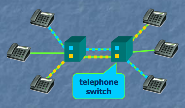

- ในปัจจุบัน automatic switch จะเปลี่ยนเส้นทางให้อัตโนมัติ
- แทนที่จะต้องคุยกับ Central Switch ก็ให้ automatic Switch เป็นคนเปลี่ยนเส้นกาคุยให้

### Packet Switching

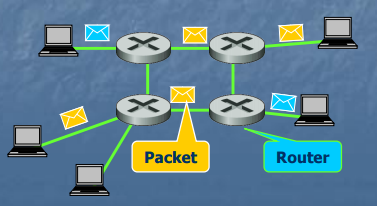

- ระบบนี้เราไม่จำเป็นต้องกังวลเรื่องคู่สายเลย เพราะแชร์กันได้
- ในการส่งแบบนี้ เราจำเป็นต้องแบ่งข้อมูลใหญ่ๆออกเป็นชิ้นเล็กๆ (Packet) ไม่ว่าข้อมูลจะใหญ่ขนาดไหนก็ตาม
- ในแต่ละชิ้นต้องมี Source and Destination Address แปะไปด้วย

  - ข้อดี
    - แชร์กันทุกอย่าง ใช้ทรัพยากรได้คุ้มค่า
    - 1 Link สามารถแชร์กับคนอื่นได้ในกรณีที่ไม่ได้ใช้

## Layered Tasks
มีหลาย Layer มีหลาย Protocol แต่ละชั้นก็จะมีหน้าที่ของมันเอง

### Example


ในโลกความเป็นจริง ถ้าสองคนเนี่ยอยากจะคุยกันมันต้องทำไง?

มันก็ไม่สามารถคุยกันได้ตรงๆ มันต้องมี service อย่างอื่นเข้ามาเพื่อทำให้สองคนนี้สามารถสื่อสารกัน

ก็จะได้ตามภาพข้างล่าง ซึ่ง เลขานุการ ไปรษณีย์ ก็เปรียบเสมือน service ต่างๆ ที่เข้ามาทำให้การสื่อสารสามารถเกิดขึ้นได้

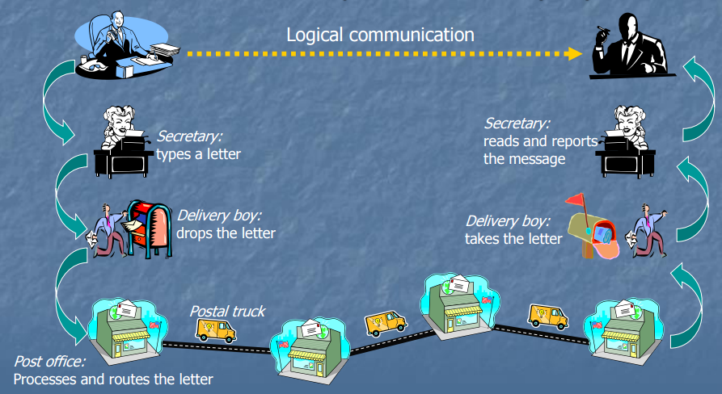

ในเรื่อง Internet ก็เหมือนกัน เราไม่สามารถสื่อสาร Application โดยตรงได้ มันต้องมี Service อื่นๆมารับรองการสื่อสารนี้

### Internet Layer Models
5 Layers Models

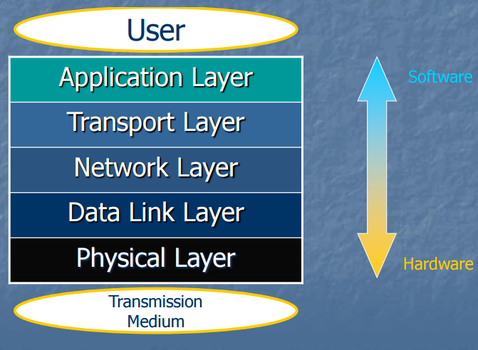

เรื่อง Protocol ส่วนไหนชั้นไหนเป็น Hardware หรือ Software มันไม่ได้แบ่งกันชัดเจน

#### Application Layer
```Javascript
Responsible for providing services to the user
```

- เป็นชั้นที่คุยติดต่อกับ User
- A เขียน App B เขียน App ทั้งสองคนตกลงกันว่าจะส่งมารูปแบบไหน เป็น Protocol เดียวกัน ชั้นนี้เรียก Application Protocol
- **Ex.** HTTP, SMTP, FTP

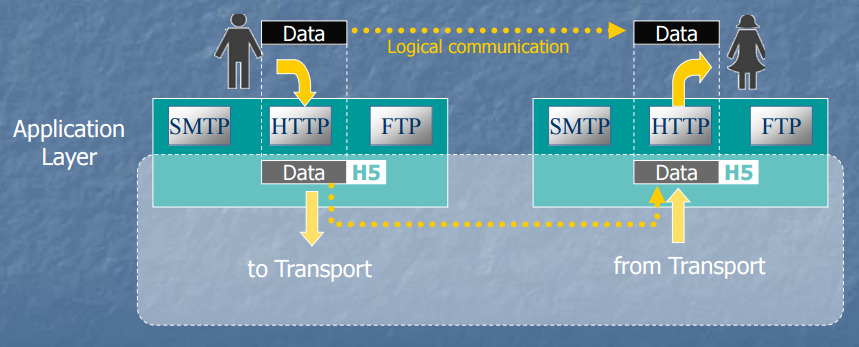

- เช่น ถ้าต้องการหน้าเว็บ `/index.html` ก็ต้องทำตามรูปแบบของ `HTTP Protocol` (ถ้าต้องการอีเมล์ก็ SMTP Protocol, ส่งไฟล์ FTP Protocol)
- เรา **ใช้** Protocol ในส่งข้อความในสิ่งที่เราต้องการ `GET /index.html HTTP/1.1` ไอเนี่ย คือ Header ที่ส่งไป ส่วน Data ในตอนส่งอาจจะไม่จำเป็นต้องมีก็ได้
- พอ Server ตอบกลับอาจจะมี Data ตอบกลับมา เช่น code html ต่างๆที่ร้องขอไป  
- เวลาที่เราต้องการจะส่งคำสั่งออกไป (Send side) http ไม่ได้ส่งด้วยตัวมันเอง เราจำเป็นต้องส่งต่อไปให้กับ service ตัวต่อไป คือ **Transport Layer** พอข้อมูลไปถึงอีกฝั่ง ตัว Application Layer ก็จะรับ (Receive side) จาก Transport Layer แล้วส่งกลับไปหาผู้ใช้ต่อไป

#### Transport Layer
```Javascript
Delivery of a message
from one process to another
```
- ทำหน้าที่ส่งข้อความ(คำสั่ง)จาก Process ไปยังอีก Process ต่อไป
- **Ex.** TCP, UDP
- **Packet Switching** มันต้องแบ่งข้อมูลไม่ว่าใหญ่แค่ไหนออกเป็นชิ้นเล็กๆก่อนที่จะส่งต่อไป
- ในการส่งแต่ละชิ้นนั้น อาจจะเกิดความผิดพลาดในการส่งขึ้นได้ ทำให้ข้อมูลหายไป **Transport Layer** จะเป็นตัวกู้ข้อมูลส่วนที่หายไปกลับมาให้ โดยฝั่งส่งจะส่งไปให้ฝั่งรับใหม่อีกครั้บ

- **Port Addressig**: Transport Layer จะดูเรื่อง Software Port ให้ ว่า Application ที่เราเขียนมันจะต้องใช้ Port อะไรในการสื่อสาร
  * _บน Internet เป็น Software Por_
- **Segmentation and reassembly**: ถ้าข้อมูลเยอะมากๆ ก็แยกเป็นชิ้นเล็กๆแล้วค่อยส่ง และสามารถกลับมาเป็นชิ้นเดียวกันได้ ตอนรับกลับมา
- **Connection control**: จัดการให้ว่าต้องส่งไปช่องไหน เหมือนการเสียบของ switch
- **Flow control**: บางครั้งข้อมูลแต่ละชิ้นอะมันส่งมาถึงไม่พร้อมกัน ตัวนี้ก็จะควยคุมไว้ให้ในตอนรวมข้อมูล
- **Error control**: บางครั้งบางชิ้นส่วนของข้อมูลมันหายไป ตัวนี้ก็จะจัดการให้

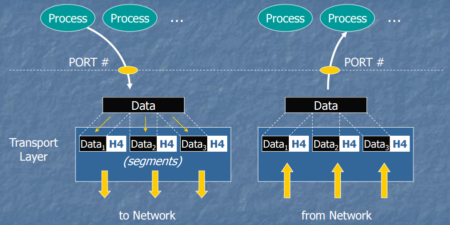

- **ขั้นแรก** เรามี Process ที่เราเขียนขึ้นมา พอเราต้องการส่งข้อมูลก็เสียบข้อมูลมาลงที่ Transport Layer

- Segment ประกอบไปด้วย
  - **Data** > รับมาจาก Application Layer
  - **H4** > Header ของข้อมูลชั้นนี้ เช่น จำนวนข้อมูล, ลำดับข้อมูล

- ในฝั่งรับ (Receiver) ก็จะรวมข้อมูลที่เป็นชิ้นๆให้ แล้วส่งกลับขึ้นไปที่ Application Layer โดยจะส่งกลับไปที่ Process ไหนก็ขึ้นอยู่กับว่า ใช้ PORT ไหน (1 Port: 1 Process ในทาง Software Process ใช้งาน Port ซ้ำกันไม่ได้)
- **Transport Layer** ไม่รู้ว่าต้องส่งไปยังไง มันก็ต้องส่ง Segment ไป Network Layer ต่อไป

#### Network Layer
```Javascript
The delivery of packets
from the original source to the destination
```
- เป็นสิ่งที่สำคัญที่สุด และ เป็นชั้นที่ common ที่สุด
- **Transport Layer** จะทำหน้าที่ส่งและรับ Process ต่อ Process แต่ **Network Layer** จะทำหน้าที่ส่ง และ รับ Hardware ต่อ Hardware
- ดังนั้น **Network Layer** ต้องรู้ว่าจะส่งไป route ไหน และ จะหา route ได้ยังไง
- **Ex.** IPv4, IPv6
- ในการที่จะรู้ทางที่จะส่งได้ ก็ต้องรู้ Address
  - **Logical addressing**: ต้องรู้ว่าจะส่งไปที่ไหน ก่อน จะได้เลือกใช้ Route ได้ถูกต้อง
  - **Routing**

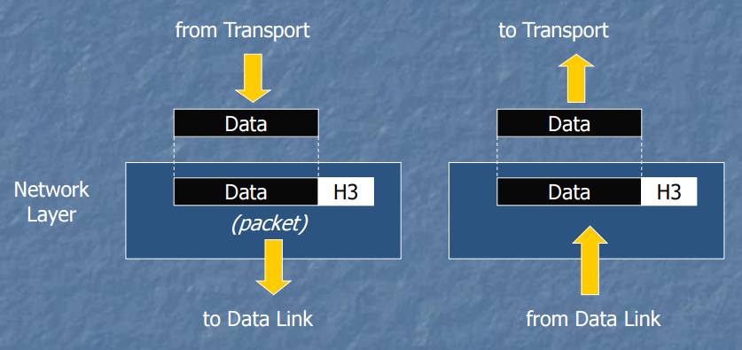

- Packet ที่จะส่งไปประกอบด้วย
  - **Data > Network Layer** รับ Segment มาจาก Transport Layer
  - **H3 > Logical Address** Address ที่ใช้สำหรับหาทางที่จะส่งข้อมูลไป
- Network Layer เป็นตัวตัดสินใจว่าจะส่ง Packet ตัวนี้ไปให้ Device (Link) ไหนต่อไป
- ถึงแม้ว่า Network Layer เป็นตัวตัดสินใจว่าจะส่งไป Link ไหน แต่ก็ส่งเองไม่ได้อยู่ดี ต้องไปพึ่ง Service ตัวต่อไป **Data Link Layer**
- ฝั่ง Destination พอรับมาก็ทำสิ่งตรงกันข้ามคือส่งกลับไปหา **Transport Layer**

##### Network Layer ทำงานยังไง?

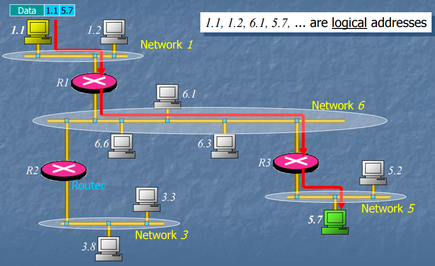
- ในการที่จะตัดสินใจส่งไปทาง Link ไหนไม่ได้ง่าย ต้องใช้หลายอย่างในการตัดสินใจ ได้แก่
  1. **Logical Addressing**
    * จากภาพเรามี Network 4 วง (ข้างในเรียก Interconnected) เราต้องสร้าง network of network
    * การที่เราจะ Link network แต่ละวงเข้าด้วยกันได้ เราก็จำเป็นต้องกำหนดชื่อ (หมายเลข) ให้ Network แต่ละวง
    * แต่ละวง จำเป็นที่จะต้องมี Unique Number ห้ามซ้ำกัน
  2. **Router**
    * Link Network แต่ละวงเข้าด้วยกัน
- จากตัวอย่าง `Data|1.1|5.7` ในการส่งข้อมูลเราไม่สนเรื่องความหมายข้อมูลข้างในอยู่แล้ว สนแค่ต้องส่งไอก้อนข้อมูลนี้ไปให้ถึงปลายทางก็พอ
- `1.1` คือ Source Address
- `5.7` คือ Destination Address
- ต่อไป **Network Layer** จะต้องตัดสินใจว่าจะส่งไป Link หรือ Device ไหนต่อไป
- `1.1 & 5.7` คนละ Network กัน เพราะความต่างของเลขตัวแรก
- `1.1 & 1.2` Network เดียวกัน เพราะเลขตัวแรกเหมือนกัน
- พอ **Network Layer** พอว่าคนละ network กัน ก็ต้องส่งออกไปหา Gateway ต่อไป (Router)
- **Router** จะเป็นตัวตัดสินต่อไปว่าจะส่งไปใน Network ไหนต่อไป
- เมื่อข้อมูลไปถึง Destination แล้ว มันก็จะส่งกลับไป **Transport Layer** ต่อไป

> รายละเอียดทั้งหมดนี้ก็ยังไม่ได้อธิบายว่ามันเลือกทางยังไง เลือกไงให้สั้นที่สุด มีอัลกลออะไรข้างใน เดะเรียนต่อหลัง Midterm นะแจ๊ะ (Shortest Path Algorithm)

#### Data Link Layer
```Javascript
Transmitting frames
from one node to the next
```
- **Data Link Layer** ทำหนาที่ส่งข้อมูลไปยัง Device ต่อไป (ไม่จำเป็นต้องเป็นปลายทาง)
- ข้อมูลที่ส่งไปในรูปแบบ **Frames**
  - เตรียมข้อมูลสำหรับ signal transmission
- **Physical Addressing**
- **Ex.** PPP, MAC
- ข้อมูลจาก **Network Layer** ก่อนจะส่งออกไปนอกเครื่อง ซึ่งมันเกิดข้อผิดพลาดได้ง่าย ต้องทำให้อยู่ในรูปที่ง่ายต่อการส่งต่อไปนอก Device เช่น Electronic signal หรือ Radio Signal

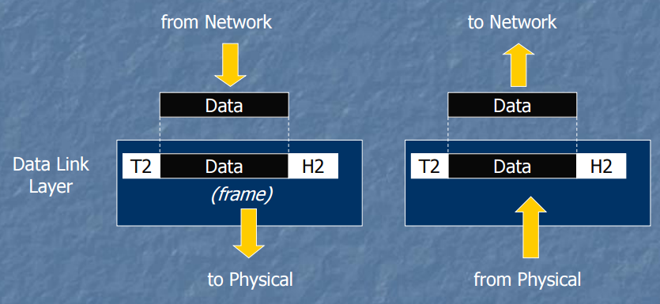

- **Framing** ประกอบด้วย
  * Header(H2)
  * Trailer(T2) - เอาไว้ตรวจสอบ Error
  * Data - ที่ส่งมาจาก Network Layer

- ในการส่งข้อมูลออกไป ไม่จำเป็นว่าจะมีแค่ Device เดียวที่รับข้อมูลได้ อาจจะมีกี่ Device ก็ได้ที่รับข้อมูลที่ส่งออกไปได้
- ดังนั้นเราจำเป็นต้องบอกตัวผู้รับตัวจริงขึ้นมา (หน้าที่ของ Data Link layer) จะทำงั้นได้ก็มีหลายทาง ทางหนึ่งนั้นก็คือใช้ **Physical Addresses**

_ตัวอย่างเช่น_ เวลาอาจารย์ถามว่า "Ong How r u?" ทำคนในห้องได้ยิน แต่คนที่ตอบกลับก็มีแค่ Ong คนเดียว

ในทำนองเดียวกันกับ ระบบ Network ข้อมูลมันจะถูกส่งออกไป และทุก Device ได้รับ แต่ถ้าข้อมูลนั้นมี physical Addresses ไม่ตรงกับของมันเอง ก็จะทิ้งข้อมูลนั้นไป (เราโกงได้ โดยรับข้อมูลทุกอย่างมา ใช้พวกโปรแกรม Wireshark ก็ทำได้แล้ว)

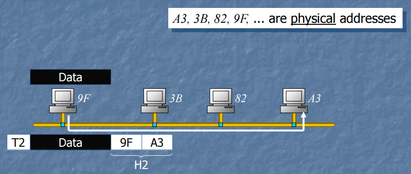

จากภาพ **H2** เป็น Header ระบุว่าจะ Physical Address ไหนเป็นตัวรับและตัวส่ง

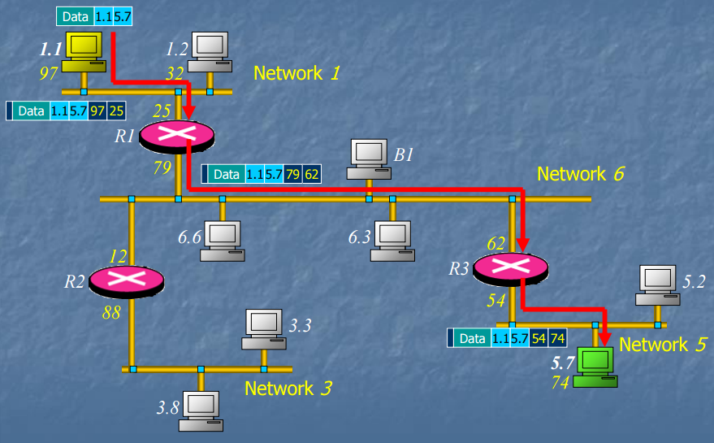

> `97/25` เครื่อง 32 จะได้รับ signal ด้วยแต่มันไม่ตรงกับ 25 เครื่องเลยไม่รับไป

จากภาพจะเห็นว่าแต่ละช่วงมันจะเพิ่ม _Machine ID_ เข้าไป 2 ชุด เพื่อบอกว่าข้อมูลชุดนี้จะส่งจาก Device ไหนไปยัง Device ไหน

อีกแล้ว Data Link layer ก็ไม่รู้อยู่ดีว่าจะส่งไปตามสาย Network ยังไง มันก็ต้องส่งไปให้ Layer ต่อไปทำงานต่อ

#### Physical Layer
```Javascript
Transmitting individual bits
from one node to the next
```
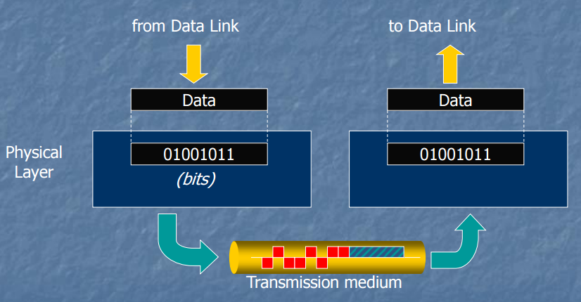
- แปลง Binary Data เป็น Electronic Data(Bit)
- เป็น Layer ที่ทำหน้าที่เกี่ยวกับ Physical ทั้งหมด

### ภาพรวม
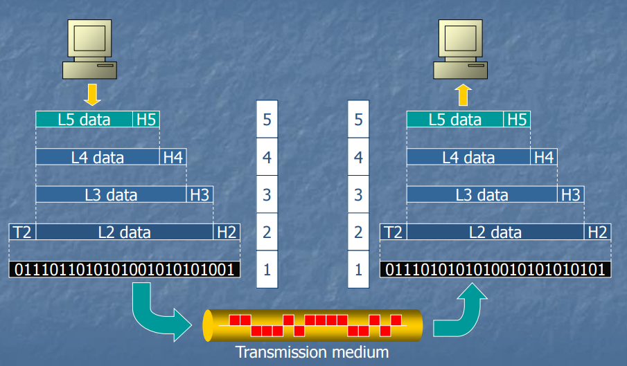

#### Internet Models  
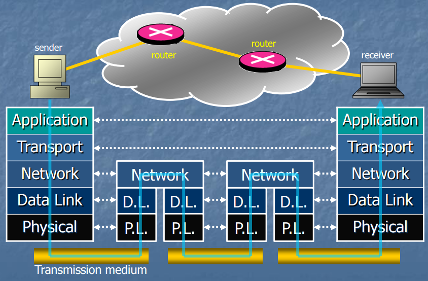

* Real Signal ถูกส่งออกไปจริงๆตอน Physical Layer

* Router ก็มี Data Link Layer กับ Network Layer เพื่อตัดสินใจต่อไปว่าจะส่งไปทางไหนต่อไป

* **MAC Address** ใช้สำหรับ **data link layer**
  * เหมือนเลขประจำตัวประชาชน (เปลี่ยนที่เลขประจำตัวประชาชนไม่เปลี่ยน)
* **IP Address** ใช้สำหรับ **network layer**
  * เหมือนเลขที่บ้าน (เปลี่ยนที่ก็เปลี่ยน)
* **Network Layer** ถ้าเปลี่ยนนี่ลำบาก แต่ Layer อื่นๆ เปลี่ยนได้ ไม่กระทบ Layer อื่นๆ

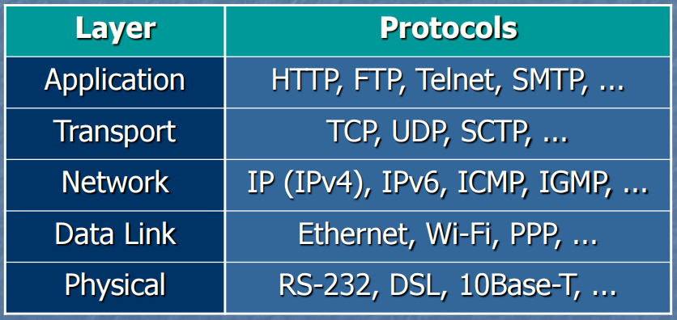
