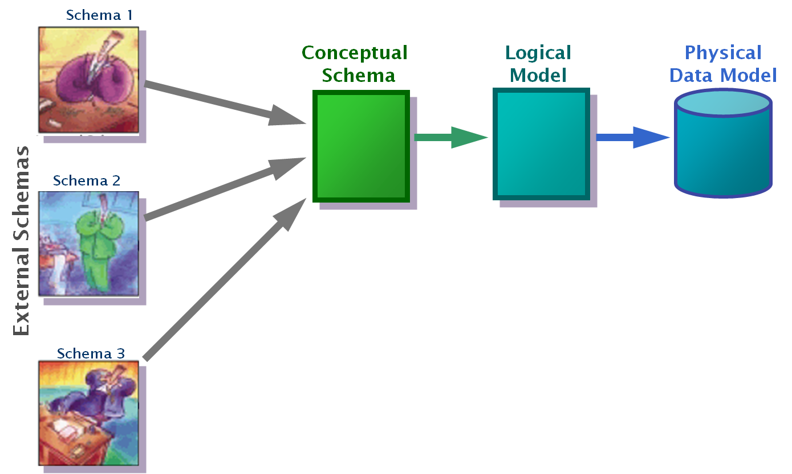
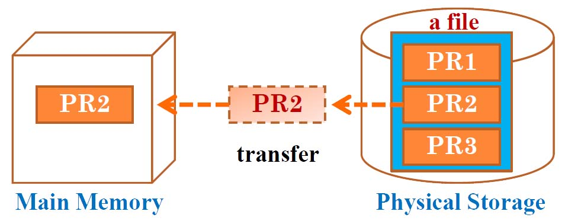
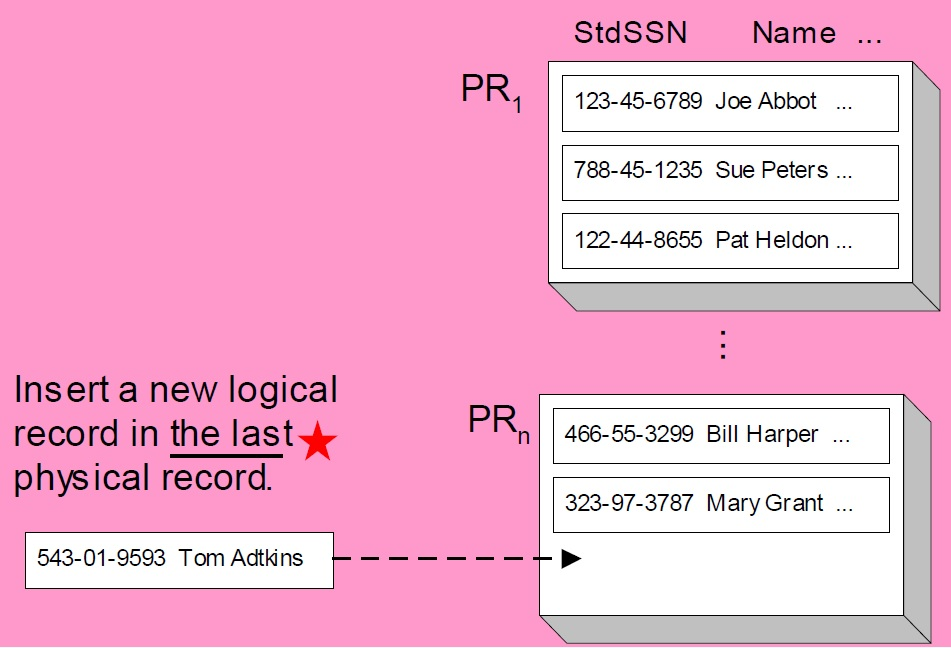
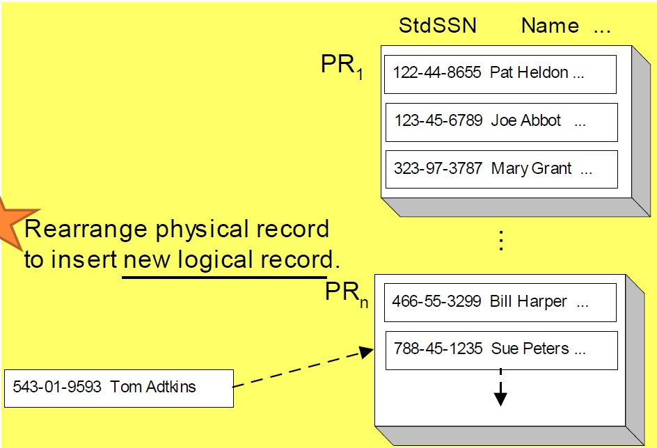

#Physical Database Design
##Data Modeling

ปกติ ถ้ามีข้อมูลมา มันก็จะแปรสภาพเป็นตาม 3 4 ลำดับ ตามนี้

1. **Schema** มีข้อมูลที่อยากจะเก็บ
2. **Logical Model** ก็พวก แปลงก่อน เป็น **ER model** , แปลงเป็นตาราง (Relation Data Model) หรือ ใช้พวก Normalization
3. **Physical Data Model** คือหลังจากได้ข้อมูลออกมาเป็น Logical แล้ว ก็หาทางแปลง Logical พวกนั้นไปเก็บใน Hard Disk, CD, หรือ Storage อะไรก็ได้สักอย่าง ที่เป็น Physical

1 - 2 คงไม่ต้องพูดถึงแล้ว

##STORAGE LEVEL OF DATABASES

- Logical Level
  - Database ประกอบด้วย Table หลายๆอัน
  - Table ประกอบด้วย Record หลายๆอัน
- Storage Level
  - แต่ละ Table เก็บเป็น File 1 อัน
  - File เป็น Record ที่ถูกจัดเก็บอย่างมีระเบียบ และเข้าใช้งานได้ง่าย

##SEQUENTIAL FILES
###UNORDERED SEQUENTIAL FILE

จับใส่ลงไปใน File ต่อไปเรื่อยๆได้เลย

###ORDERED SEQUENTIAL FILE

จับ Record ใส่ลงไฟล์อย่างมีลำดับ

###HASH FILES
- เป็นระบบเก็บไฟล์ที่การเข้าถึงได้ไวที่สุด เพราะใช้ Unique Key
- เปลี่ยน Key ที่ได้เป็น Physical Record Address
- Hash Functions
  - **Divisor** : เป็นจำนวนเฉพาะที่ขนาดใหญ่มาๆ ซึ่งมีขนาดใกล้เคียงกับไฟล์
