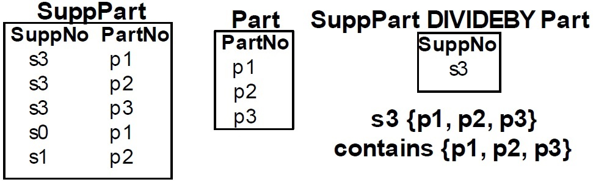

#Chapter9 - Advanced Query Formulation with SQL
> แนะนำให้ดู Slide ของอาจารย์ตามไปด้วย

##SQL Outer Join
* การเชื่อม Table หนึ่งกับอีก Table หนึ่งตามความสัมพันธ์ที่กำหนดไว้
* Join มีสองแบบ
  1. **Inner Join** - ทั้ง 2 ตารางต้องมีข้อมูลที่สัมพันธ์กัน ไม่มีฝั่งใดฝั่งหนึ่งว่างเปล่า
  2. **Outer Join** - ทั้ง 2 ตารางที่ Join ไม่จำเป็นต้องมีข้อมูลสัมพันธ์กัน ขึ้นอยู่กับจะ Outer แบบไหน
    - **Full Outer Join** - ทั้ง 2 ฝั่ง มี Priority เท่ากัน
    - **Left Outer Join** - ให้ Priority ฝั่งซ้ายสำคัญกว่า
    - **Right Outer Join** - ให้ Priority ฝั่งขวาสำคัญกว่า

###อย่าเพิ่ง งง!!! ดูตัวอย่างก่อนนนน

สมมติมีข้อมูลการเล่น DotA กับ Hero ที่เล่น 2 ตารางดังนี้

_Account_

| userId | Username | heroId |
| ---------- |:-------:| ------------- |
| 00001 | ChinCluBi | 02 |
| 00002 | Ongoing | 01 |
| 00003 | smartLT | 04 |
| 00004 | iNont | 05 |
| 00005 | ChokePed | null |

_Hero_

| heroId | Name |
|:------:| ------ |
| 01 | FACELESS VOID |
| 02 | PHANTOM ASSASSIN |
| 03 | SVEN |
| 04 | ZEUS |
| 05 | PUDGE |
| 06 | SILENCER |
| 07 | SKYWRATH MAGE |

**Inner Join**
```sql
SELECT userId, Username, Hero.Name AS Hero
FROM Account INNER JOIN Hero ON Account.heroId = Hero.heroId
```
_Result_

| userId | Username | Hero |
| ------ | -------- | ------|
| 00001 | ChinCluBi | PHANTOM ASSASSIN |
| 00002 | Ongoing | FACELESS VOID |
| 00003 | smartLT | ZEUS |
| 00004 | iNont | PUDGE |

**Full Outer Join** - ไม่เคยเห็นใครใช้
```sql
SELECT userId, Username, Hero.Name AS Hero
FROM account LEFT JOIN hero ON account.heroId = hero.heroId
UNION
SELECT userId, Username, Hero.Name AS Hero
FROM account RIGHT JOIN hero ON account.heroId = hero.heroId
```

_Result_

| userId | Username | Hero |
| ------ | -------- | ------|
| 00001 | ChinCluBi | PHANTOM ASSASSIN |
| 00002 | Ongoing | FACELESS VOID |
| 00003 | smartLT | ZEUS |
| 00004 | iNont | PUDGE |
| 00005 | ChokePed | _NULL_ |
| _NULL_ | _NULL_ | SVEN |
| _NULL_ | _NULL_ | SILENCER |
| _NULL_ | _NULL_ | SKYWRATH MAGE |

จะเห็นว่าทั้ง 2 ตาราง รวมกันเป็น 1 ตารางเลย โดยที่ไม่ว่าจะสัมพันธ์กันหรือไม่ ( หมายถึงเงื่อนไข ตรง ON )

**Left Join**
```sql
SELECT userId, Username, Hero.Name AS Hero
FROM account LEFT JOIN hero ON account.heroId = hero.heroId
```

_Result_

| userId | Username | Hero |
| ------ | -------- | ------|
| 00001 | ChinCluBi | PHANTOM ASSASSIN |
| 00002 | Ongoing | FACELESS VOID |
| 00003 | smartLT | ZEUS |
| 00004 | iNont | PUDGE |
| 00005 | ChokePed | _NULL_ |

ผลลัพธ์ที่ได้จะเห็นว่ามันยึดตามตารางทาง **ซ้าย(Account)** ก็จะมีจำนวน row เท่ากับตาราง Account ส่วน row ไหนที่ไม่มีความสัมพันธ์กับ Hero ก็จะขึ้น NULL มา

**Right Join**
```sql
SELECT userId, Username, Hero.Name AS Hero
FROM account RIGHT JOIN hero ON account.heroId = hero.heroId
```
_Result_

| userId | Username | Hero |
| ------ | -------- | ------|
| 00001 | ChinCluBi | PHANTOM ASSASSIN |
| 00002 | Ongoing | FACELESS VOID |
| 00003 | smartLT | ZEUS |
| 00004 | iNont | PUDGE |
| _NULL_ | _NULL_ | SVEN |
| _NULL_ | _NULL_ | SILENCER |
| _NULL_ | _NULL_ | SKYWRATH MAGE |

จะยึดตามตารางทางขวา (ตาราง Hero) จนครบ ส่วนอันไหนที่ทางซ้าย (ตาราง Account) อันไหนที่ไม่มีความสัมพันธ์กัน ก็จะขึ้น NULL

##Nested Queries

###Type1
- Query ซ้อน Query
- เหมือนการเขียน Condition ในรูป SQL
- ทำงานแค่รอบเดียว
- ไม่มีจุดเชื่อมต่อไป Query ข้างนอก

####ตัวอย่างจากใน slide
```sql
SELECT FacSSN, FacLastName, FacDept
FROM Faculty WHERE FacDept = 'FIN' AND FacSSN IN
( SELECT FacSSN FROM Offering WHERE CourseNo LIKE 'IS*’)
```
####การทำงาน
>**INNER QUERY** : sql จะ query ตารางจากใน (...) ออกมา<br>
>**OUTER QUERY** : จะ query จากเงื่อนไข _WHERE_ และ FacSSN อยู่ใน ตารางที่ query จากในข้อ 1 หรือไม่ ( IN : ==)

###Type2
- เหมือนการเขียน Nested Loop ในรูปภาษา SQL
- มีจุดเชื่อมต่ไป Query ข้างนอก
- เนื่องจากมีจุดเชื่อมไป Query ด้านนอก ดังนั้นทุกๆ row จะต้องมีการทำ SubQuery ใหม่ทุกๆรอบ เหมือนการวน Loop เพราะว่าแต่ในละ row เงื่อนไขที่เชื่อมไป Outer Query มันไม่ใช่ค่าเดิม

####ตัวอย่างจากใน slide

```sql
SELECT FacSSN, FacLastName, FacDept
FROM Faculty WHERE FacDept = 'MS' AND NOT EXISTS
( SELECT * FROM Offering
WHERE OffTerm = 'WINTER' AND OffYear = 2006 AND Faculty.FacSSN = Offering.FacSSN )
```
####การทำงาน
>**LOOP** 1 until numOf row :
  >>**OUTER QUERY** : sql จะ query จากเงื่อไขใน WHERE
    >>>เช็ค NOT EXISTS =>
    >>>>**INNER QUERY** : ใช้ค่า Faculty.FacSSN จาก OUTER QUERY ของ row นั้นๆ

- นอกจาก IN แล้ว ยังมีการใช้ NOT IN ได้อีก หรือ มองอีกแง่คือ !=
- ยังมีคำสั่ง IS NULL อีก ซึ่งก็คือ ค่าของ column นั้นๆ เป็น NULL หรือเปล่า
- คำสั่ง MINUS จะอยู่ตรงกลางระหว่าง 2 Query
  - Query A MINUS Query B หมายถึง อะไรก็ตามที่อยู่ใน A แต่ไม่อยู่ใน B (เหมือนเรื่อง Set)

##Table Expression
- เหมือนการตั้งชื่อ ให้กับ SubQuery จะได้เอาไปใช้ต่อได้สะดวกๆ

###ตัวอย่าง
```sql
SELECT T.CourseNo, T.CrsDesc,
COUNT(*) AS NumOfferings,
Avg(T.EnrollCount) AS AvgEnroll
FROM
(SELECT Course.CourseNo, CrsDesc,
Offering.OfferNo,
COUNT(*) AS EnrollCount
FROM Offering, Enrollment, Course
WHERE Offering.OfferNo = Enrollment.OfferNo
AND Course.CourseNo = Offering.CourseNo
GROUP BY Course.CourseNo, CrsDesc,
Offering.OfferNo) T
GROUP BY T.CourseNo, T.CrsDesc
```

จากตัวอย่างจะเห็นว่าพอเรามี SubQuery ถ้าไม่เขียนชื่อให้มันก็จะเข้าไปใช้ต่อไม่ได้ เค้าเลยกำหนดชื่อให้มัน ในตัวอย่างคือชื่อ T

##Divide Operator
- ใช้หาว่าตัวไหนบ้างของ QueryA อยู่ใน QueryB ทุกตัว



**จากตัวอย่าง** จะเห็นว่า Divide ใช้หา SuppNo ทุกตัวที่ PartNo ครบทุกตัวจากใน Part

###COUNT Method for Division Problems
ตัวอย่าง

```sql
SELECT StdNo FROM StdClub GROUP BY StdNo HAVING COUNT(*) = ( SELECT COUNT(*) FROM Club )

```

**การทำงาน**
- ขั้นแรกจะ COUNT จำนวน Club ออกมาก่อน
- หานักเรียนจากตาราง StdClub (ตารางที่เอาไว้เชื่อม Student กับ Club เพื่อบอกว่า นักเรียนคนไหนอยู่ Club ไหนบ้าง)
- มันก็จะ Group นักเรียนที่มี StdNo เดียวกัน แล้วเรียก COUNT ออกมา เพื่อดูจำนวน Club ที่ นักเรียนคนนั้นอยู่
- ถ้าจำนวน Club ที่นักเรียนคนนั้นอยู่ = จำนวน Club ที่มีก็จะแสดงผลออกมา ตามเงื่อนไขใน HAVING 
