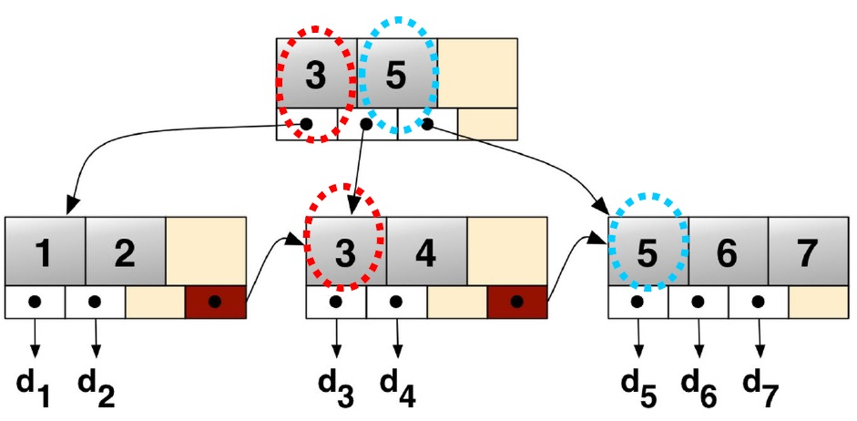

#Physical Database Design
##Data Modeling

ปกติ ถ้ามีข้อมูลมา มันก็จะแปรสภาพเป็นตาม 3 4 ลำดับ ตามนี้

1. **Schema** มีข้อมูลที่อยากจะเก็บ
2. **Logical Model** ก็พวก แปลงก่อน เป็น **ER model** , แปลงเป็นตาราง (Relation Data Model) หรือ ใช้พวก Normalization
3. **Physical Data Model** คือหลังจากได้ข้อมูลออกมาเป็น Logical แล้ว ก็หาทางแปลง Logical พวกนั้นไปเก็บใน Hard Disk, CD, หรือ Storage อะไรก็ได้สักอย่าง ที่เป็น Physical

1 - 2 คงไม่ต้องพูดถึงแล้ว

##STORAGE LEVEL OF DATABASES

- Logical Level
  - Database ประกอบด้วย Table หลายๆอัน
  - Table ประกอบด้วย Record หลายๆอัน
- Storage Level
  - แต่ละ Table เก็บเป็น File 1 อัน
  - File เป็น Record ที่ถูกจัดเก็บอย่างมีระเบียบ และเข้าใช้งานได้ง่าย

##SEQUENTIAL FILES
###UNORDERED SEQUENTIAL FILE

จับใส่ลงไปใน File ต่อไปเรื่อยๆได้เลย

###ORDERED SEQUENTIAL FILE

จับ Record ใส่ลงไฟล์อย่างมีลำดับ

###HASH FILES
- เป็นระบบเก็บไฟล์ที่การเข้าถึงได้ไวที่สุด เพราะใช้ Unique Key
- เปลี่ยน Key ที่ได้เป็น Physical Record Address
- Hash Functions
  - **Divisor** : เป็นจำนวนเฉพาะที่ขนาดใหญ่มากๆ ซึ่งมีขนาดใกล้เคียงกับไฟล์ // มันก็จะ mod เลยออกมาเป็นเลขจำนวนหนึ่ง
  - **Physical Record Number** : จากข้างบนพอได้เลขที่ mod ออกมาแล้ว ก็จะเอาไปบวกกับ Physical Address เริ่มต้น ผลลัพธ์ที่ได้คือ Address ที่จะเก็บของไฟล์

##BTrees
- เป็น Data Structure อย่างหนึ่ง มีลักษณะคล้ายๆกับ Binary Tree แต่ไม่ใช่ Binary Tree นะจ๊ะ
- BTrees เป็นชุดข้อมูลแบบจัดเรียงแล้ว พร้อมสำหรับการค้นหา เข้าถึง แทรก หรือ ลบข้อมูล
- เหมาะสำหรับการใช้งานในฐานข้อมูลขนาดใหญ่ๆ เช่น ฐานข้อมูล และ ระบบแฟ้ม
- Underflow คือ ในกรณีที่ node นั้นๆมี element ต่ำกว่าค่าต่ำสุดที่เป็นไปได้
- กระบวนการ Insert, Delete, Find ให้ดูจากข้างล่างเลย ไม่ยาก

> https://www.cs.usfca.edu/~galles/visualization/BTree.html

> ไปลองในนี้ขี้เกียจก๊อปให้ดู =3= // กระบวนการข้างในเหมือนในสไลด์เลย เชื่อได้ๆ

##B+Tree

**ความต่างของ B+Tree vs BTree**
- ทุก key ใน B+Tree จะเก็บใน leaf node หมดเลย

##ข้อดีข้อเสียของ BTree & BPlusTree
- **BTree**
  - มันใกล้ Root เพราะว่าทุกๆ Key ไม่จำเป็นต้องอยู่บน Leaf เท่านั้น ทำให้การเข้าถึง Key ทำได้ง่าย และรวดเร็ว
- **BPlusTree**
  - เพราะ Leaf ของ B+ เป็น Link ดังนั้นถ้าทำการ Full Scan จะทำได้ไวกว่า เพราะทำงานผ่าน Leaf แค่ระดับเดียวเท่านั้น ต่างจาก B ที่ต้องทำงานผ่านทุกชั้นเลย
  - ใช้ cache น้อยกว่า เพราะไม่จำเป็นต้องเข้าถึง node อื่นๆนอกจาก leaf ทำให้เก็บใน page ของ memory ได้มากกว่า ทำให้การเกิด miss rate ลดลง

##BitMap Index
- ไม่รู้จะอธิบายไงว่ามันคืออะไร ไปดูตัวอย่างเลยแล้วกัน

**ตัวอย่าง**

| customerNo | region |
|:----------:|:------:|
| 00001 | north |
| 00002 | south |
| 00003 | east |
| 00004 | west |
| 00005 | east |
| 00006 | south |
| 00007 | west |
| 00008 | west |
| 00009 | east |
| 00010 | west |

###BitMap Index
- **north**: 1 0 0 0 0 0 0 0 0 0
- **south**: 0 1 0 0 0 1 0 0 0 0
- **west**  : 0 0 0 1 0 0 1 1 0 1
- **east**  : 0 0 1 0 1 0 0 0 1 0

คือใช้บอกว่า index ไหนมีค่านั้นๆบ้าง ถ้าเป็นจะแทน bit 1 ถ้าไม่เป็นจะแทน bit 0

ถ้าเราจะ search หา account ที่อยู่ภาคเหนือก็สามารถหาจาก BitMap ได้เลยว่ามี row ไหนเป็น 1 บ้าง ไม่ต้องไปวนหาในตารางจริงๆ

##BitMap Join Index
- BitMap เฉยๆ คือ เอาไว้อ้างอิงกับตารางของมันเอง
- แต่ BitMap Join เอาไว้ระบุค่าของตารางที่เกี่ยวข้องกัน(คือมีการ Join ตารางกัน)
- ช่างมัน การทำงานไม่มีไรต่างกันกับ BitMap ธรรมดา อยากรู้ดูสไลด์หน้า 52

##BITMAP INDEX: RANGE SEARCHES

- ก็คือถ้าจะ search ตั้งแต่ 101-102 ก็เอา bitmap มา union กันได้เลย จะได้ bitmap ที่จะอ้างอิงไปหา row ของช่วง 101-102 ทันที

##PRIMARY FILE STRUCTURE VS SECONDARY FILE STRUCTURE
- ไม่รู้คือไร เจอคำตอบแล้วบอกกูด้วย =3=
- ต่างกันที่
  - **PRIMARY** จะเก็บข้อมูลทั้งหมดของ Table
  - **SECONDARY** จะเก็บเฉพาะ Key ที่ทำหน้าที่เป็น pointer ชี้ไปยัง Data Record

##QUERY OPTIMIZATION
- ทำให้ Query Processing มีประสิทธิภาพมากยิ่งขึ้น

###TRANSLATION TASKS

- เป็นกระบวนการวิเคราะห์ Query
- แปลง Query ให้มันง่าย และ เป็นไปตามมาตรฐานเพื่อให้มันทำงานได้ไวขึ้น
- กำหนดวิธีและกระบวนการในการเข้าถึงข้อมูล
- **Access Plan** วิธีการที่จะเข้าถึงข้อมูล

###INDEX SELECTION
- คือเวลาจะเข้าถึงข้อมูลตัวที่ xx ไม่จำเป็นต้องหาตั้งแต่ตัวที่ 1 สามารถเข้าไปหาที่ตัวที่ xx ได้เลย

###NORMALIZED DESIGNS
- ตามที่เคยเรียนมาเลย
