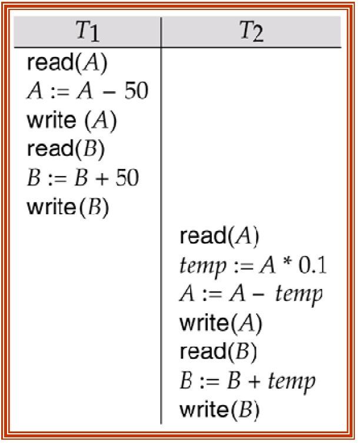
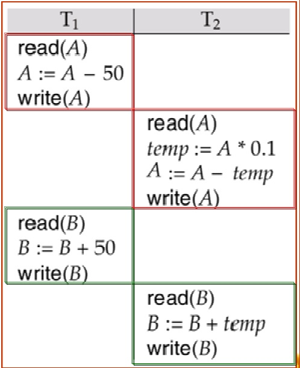
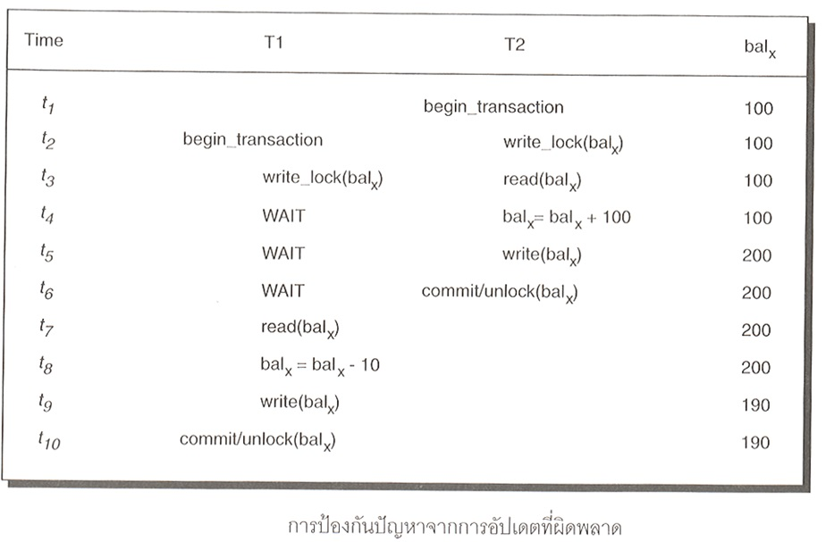
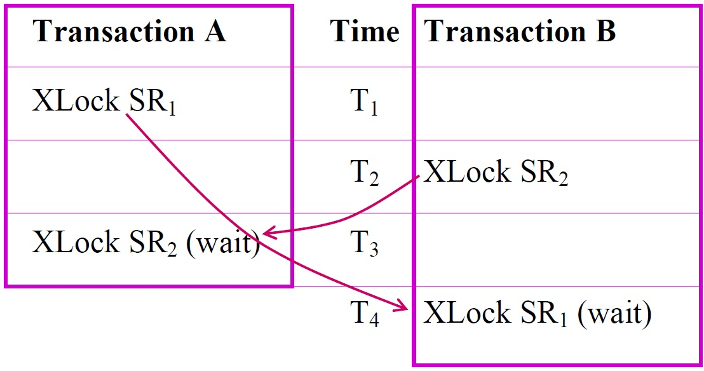
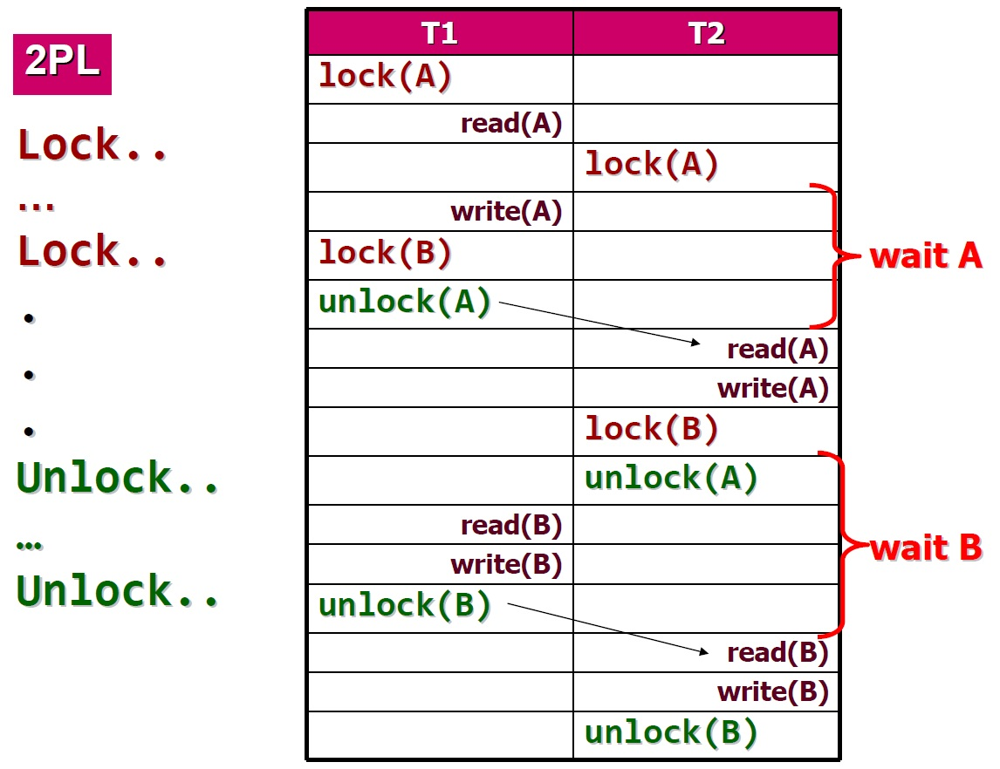

#Transaction

##Transaction คืออะไร?

- หน่วยของการทำงานในเชิงตรรกะ (มองเป็นขั้นตอนการทำงานอย่างใดอย่างนึงก็ได้นะจ๊ะ =3=)
- ภายในหนึ่งการเปลี่ยนแปลงอาจจะประกอบด้วย 1 คำสั่ง หรือ หลายคำสั่งก็ได้

แต่ในการทำงานแต่ละอย่าง เช่น การถอนเงินธนาคาร ถ้าคน 2 คนถอนเงินพร้อมกันในเวลาใกล้เคียงกัน อาจจะทำให้เกิดข้อผิดพลาดในการทำงานได้ เช่น เงินที่ควรจะเหลือไม่ถูกต้องตามที่ควรจะเป็น

##SQL Statement
- **Start Transaction**
  - กำหนดจุดเริ่มต้นของการทำ Transaction
- **COMMIT**
  - คำสั่งทุกอย่างใน Transaction ทำงานเสร็จสมบูรณ์ทุกคำสั่ง มีผลทำให้ค่าในฐานข้อมูลมีการเปลี่ยนแปลงที่ถูกต้อง
- **ROLLBACK**
  - มีบางคำสั่งในการประมวลผลทำงานไม่ถูกต้อง ทำให้ระบบต้องยกเลิกทุกอย่างใน Transaction นี้ แล้วย้อนกลับไปยังจุดเริ่มต้นก่อนเริ่มทำ Transaction

##คุณสมบัติของ Transaction (ACID)
- Atomicity
- Consistency
- Isolation
- Durability

###Atomicity - All or nothing
ก็คือ ถ้าทำสำเร็จก็จะสำเร็จทั้งหมด ถ้าไม่เสร็จก็จะไม่เสร็จเลย ไม่มีแบบครึ่งๆกลางๆ

###Consistency
สถานะของฐานข้อมูลจะต้องสอดคล้องกันทั้งก่อนและหลัง Transaction

###Isolated
จะต้องไม่มีการรบกวนจาก User อื่นๆ หากมีการทำงานในเวลาเดียวกัน

###Durability
ถ้าสถานะการทำงานเป็น `COMMIT` คือทำงานสำเร็จ ผลของ Transaction นั้นจะต้องอยู่คงต่อไปถาวร

##Transaction Processing Services
- **Concurrency Control** - การรักษาความถูกต้องให้กับข้อมูล
- **Recovery Management** -
- **Service Characteristics** -

##Concurrency Control
กำหนดลำดับการทำงานให้กับแต่ละ Transaction ที่เรียกใช้ข้อมูลพร้อมๆกัน เรียกว่า "Schedule"

ทำได้ 2 แบบ คือ _Serial Schedule_ และ _Concurrent Schedule_

###Serial Schedule
เป็นการทำงานทีละ Transaction คือ ไม่มีทางที่จะทำหลายๆ Transaction พร้อมๆกันในเวลาเดียวกัน อีก Transaction จะเริ่มทำงานก็ต่อเมื่อ Transaction ก่อนหน้านี้ทำงานเสร็จเรียบร้อยแล้ว

จากภาพข้างล่างจะเห็นว่า T1 จะทำงานจนเสร็จก่อน แล้วค่อยเริ่มทำ T2

###Concurrent Schedule
แตกต่างจาก Serial Schedule ตรงนี้วิธีนี้จะแบ่ง Transaction ออกเป็นส่วนๆ จะได้ผลเหมือนกับแบบแรก

###Concurrency Control Problem
ปัญหาจากการเข้าถึงข้อมูลพร้อมกันมี 4 ประเภท ได้แก่ (ในสไลด์อาจารย์เขียนไว้ 4 แต่ข้างนอกเขียนไว้ 3)

1. Lost Update Problem
2. Uncommitted Dependency Problem
3. Inconsistent Retrieval Problems
4. Incorrect summary  problem

####Lost Update Problem
สาเหตุนี้เกิดขึ้นในกรณีที่ 2 Transaction หรือมากกว่า เรียกใช้ ข้อมูลเดียวกัน ต่างฝ่ายต่างเข้าไปปรับปรุงข้อมูล โดยไม่มีการป้องกันจากอีกฝ่ายหนึ่ง

เช่น

| Transaction A | Time | Transaction B |
|:-------------:|:----:|:-------------:|
| Read SR (10) | T1 |  |
|  | T2 | Read SR(10) |
| IF SR > 0 then  SR = SR - 1 | T3 |  |
|  | T4 | IF SR > 0 then   SR = SR - 1 |
| Write SR(9) | T5 |  |
|  | T6 | Write SR(9) |

จากการทำงาน SR ตัวใดตัวหนึ่งควรจะเป็น 8 ไม่ได้ใช่ 9 ทั้งคู่

####Uncommitted Dependency Problem
สาเหตุของปัญหานี้เกิดจากการที่ Transaction หนึ่งอนุญาติให้อีก Transaction หนึ่งเข้าไปอ่านค่าในตัวมันเอง โดยยังประมวลผลได้ไม่เสร็จสมบูรณ์(UNCOMMIT) ทำให้เกิดข้อผิดพลาด

เช่น

| Transaction A | Time | Transaction B |
| :-------------:| :-------------:|:---------------:|
| Read SR(10)       | T1       |  |
| SR = SR - 1 | T2 |  |
| Write SR(9) | T3 |  | << การเขียนทำงานผิดพลาด
|  | T4 | Read SR(9) |
| ROLLBACK | T5 | . |

จากการทำงาน T3 Write SR(9) ทำงานผิดพลาด แล้วจะทำการ ROLLBACK กลับไปที่ SR 10 ที่เวลา T5 แต่มีการเข้ามาอ่านข้อมูลที่ T4 ก่อนที่จะทำการ ROLLBACK

####Inconsistent Retrieval Problems
เกิดจากการทำ 2 Transaction หรือ มากกว่าเข้าไปเรียกใช้ข้อมูลเดียวกัน แต่มี Transaction หนึ่งที่ได้รับข้อมูลที่อยู่ในสถานะที่ไม่ถูกต้องไปใช้งาน ส่งผลให้การประมวลผลของ Transaction มีข้อผิดพลาด

_ตัวอย่างในสไลด์ที่ 33-34_

####Incorrect Summary Problems
ปัญหารการวิเคราะห์ข้อมูลที่ขัดแย้งกัน เป็นปัญหาที่เกิดจากมี Transaction ต้องการจะอัพเดทค่า แต่ผลลัพธ์ยังไม่ได้การ Commit ส่งผลให้ Transaction ใหม่ที่เข้ามาอ่านค่าขณะยังไม่ได้อัพเดท อ่านค่าที่ผิดไป

_ตัวอย่างในสไลด์ที่ 36_

###How to solve Concurrency Control Problem?

####1).Locking
Lock เป็นเทคนิคการกำหนดสถานะให้กับ Transaction ด้วยการกำหนดให้ Transaction ที่ใช้งานอยู่ อยู่ในสถานะ Lock เพื่อป้องกัน Transaction อื่นๆเข้ามาใช้งาน

ประกอบไปด้วย 2 ประเภท
1. Shared Lock(Read Lock) - ทำการอ่านข้อมูลได้ แต่เขียนข้อมูลไม่ได้
2. Exclusive Lock(Write + Read Lock) - ทำได้ทั้งการอ่านและเขียนข้อมูล

ถ้ามี Transaction ไหนต้องการเข้ามาใช้ในช่วง Lock จะให้ใช้สถานะ wait เพื่อรอเข้าไปใช้งานข้อมูล

######DeadLock
เกิดจากการที่หลาย Transaction มีการ wait กันไปกันมา เกิดจากปัญหาการ Locking

**การแก้ปัญหา Deadlock**
- **Detection** วิธีตรวจหา Deadlock
  - สร้าง graph ขึ้นมาเพื่อสังเกตุ cycle ที่เกิดขึ้นใน graph
  - Deadlock ส่วนใหญ่จะเกี่ยวข้องกับ 2 - 3 Transaction
- **Prevention** การป้องกัน Deadlock
  - กำหนด Limit ให้สถานะ wait
  - ยกเลิก Transaction ที่ไม่ใช่ Deadlock ได้

####2).Two Phase Locking (2PL)
- ใช้แก้ปัญหา Lost Update Problems
- แนวคิดของวิธีนี้คือ
  - จะต้อง `lock` ก่อนที่จะทำงานกับ item ใดๆ
  - `wait` เมื่อ item ที่ต้องการอยู่ในสถานะ lock
  - ใน 1 Transaction ถ้า unlock แล้ว ไม่สามารถทำการ lock ได้อีกครั้ง
- การทำงานแบ่งออกเป็น 2 ระยะ ได้แก่
  1. Expanding phase
    - ระยะที่ Transaction จะทำการ Lock data item ที่ตนต้องการทำงานไปเรื่อยๆ จนกว่าจะได้รับ data item ครบตามที่ตนเองต้องการ ซึ่งในระยะนี้ Transaction จะไม่ยอมให้ Transaction อื่นๆเข้ามาใช้งาน item ที่ตัวเอง lock เอาไว้เด็ดขาด
  2. Shrinking phase
    - ระยะที่ Transaction นั้นๆ unlock item ที่ตัวเอง lock เอาไว แปลว่า Transaction นั้นๆ ทำการประมวลผล item ต่างๆเสร็จหมดแล้ว และจะไม่มีการเรียก item นั้นซ้ำอีกแน่นอน
- **ข้อเสีย** เนื่องจากต้องรอ item ไปเรื่อยๆ วิธีทำให้ Transaction ถือครอง item นานมากๆ
- **ข้อดี** วิธีนี้จะให้ผลลัพธ์ที่ถูกต้องแน่นอน Serializability

####3).Timestamp-Based Protocols
กำหนดเวลาให้ item แทนการ Lock เพื่อแจ้งให้แต่ละ Transaction ทราบว่าข้อมูลนั้น ถูกเปลี่ยนแปลง หรือ ถูกอ่านเมื่อใด

แบ่งออกเป็น 2 ส่วน ได้แก่
1. **W-Timestamp** เวลาล่าสุดที่ข้อมูลถูกเขียน (มีการเปลี่ยนค่า)
2. **R-Timestamp** เวลาล่าสุดที่ข้อมูลถูกอ่าน (ถูกนำไปใช้งาน)
