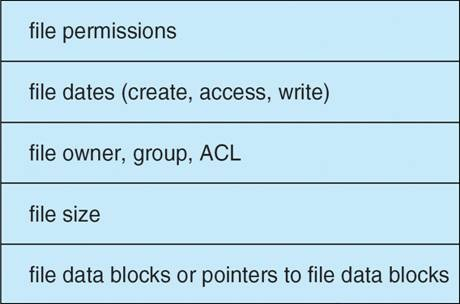
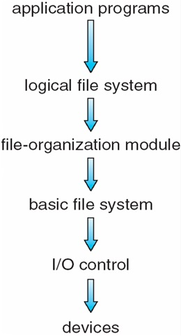
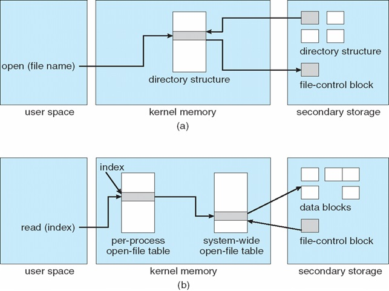

#File System Implementation

##File System Structure

###File system
* **File System** อยู่บน Harddisk(secondary disk)
* ช่วยจัดการการแปลงข้อมูลฝั่ง Logical กับ Physical
* File System ช่วยในการเก็บและเรียกใช้ข้อมูลลง Disk ให้ง่ายขึ้น
* Disk ส่วนมากจะเก็บข้อมูลเป็น Block หรือ Sectors ซึ่งปกติขนาดจะประมาณ 512 bytes

###File control block
* เป็นตัวเก็บเกี่ยวกับรายละเอียดและโครงสร้างของไฟล์นั้นๆ
* จากภาพข้างล่างจะเห็นว่ามันจะเก็บ permissions, file dates, owner, size บลาๆๆ อีกมากมาย

###Device driver

* ก็คือ Driver อะนะ
* เป็นตัวจัดการฝั่ง Physical Device

##Layered File System

* เวลา File System มันทำงานมันจะทำงานต่อกันเป็นทอดๆ เป็น Layer ไป

###Logical File System
* เป็นตัวเก็บข้อมูลต่างๆเกี่ยวกับไฟล์ ทำหน้าที่เชื่อมระหว่าง Application Programs กับ OS
  * ตำแหน่งต่างๆของข้อมูล
  * เนื่องจากในบางครั้ง ผู้ใช้ อาจจะเห็นไฟล์แค่ 1 ไฟล์ แต่ในความเป็นจริงใน Harddisk อาจจะเก็บไว้แยกๆ กัน ตัวนี้จะเป็นตัวจัดการในเรื่องนี้
* ตัวอย่างใน ระบบ Unix คือ **inodes**

###File Organization Module
* เป็นตัวแปลงข้อมูลจาก Logical Block เป็น Physical Block
* คอยจัดการเรื่อง Free Space, Disk Allocation

###Basic File System
* เป็นตัวออกคำสั่ง Driver ให้ทำงาน
* ไอเหี้ยนี่เป็นตัวจัดการ cache กับ buffer อีกด้วย(allocation, freeing, replacement)
* เป็นตัวอ่านหรือเขียนข้อมูลในส่วน Physical Block

###I/O Control
* ประกอบด้วย Device Driver เป็นตัวออกคำสั่งให้ Device ทำงานได้
* เป็นตัวออกคำสั่งในส่วน **I/O Control** คอยสั่งการไปให้ Device นั้นๆทำงาน

##ตัวอย่าง File System
* **Windows** : FAT, FAT32, NTFS
* **Unix** : UFS, FFS
* **Linux** : ext2, ext3, ext4
* **อื่นๆ** : ZFS, GoogleFS, Oracle ASM, FUSE

##File-System Implementation
* การดำเนิกงานไฟล์ในระบบ แบ่งเป็น 2 อย่างคือ
  1. **On-disk Structure** เป็นการดำเนินงานของไฟล์ในระบบของ Disk
      - **Boot Control Block** - เก็บข้อมูลในการ Boot Windows
      - **Volume Control Block** - Linux เรียก _Superblock_, Windows เรียก _Master File Table_ : เอาไว้เก็บข้อมูลของ Block เช่น มี Block ทั้งหมดกี่อัน, จำนวน Block ที่เหลือ, ขนาดของ Block, Block ที่ว่างอยู่
      - **Directory Structure** - โครงสร้างในการจัดกา Path ต่างๆของ File เพื่อลิ้งค์ไปยัง _FBC_
      - **FBC หรือ inodes** - เคยพูดถึงไปแล้ว เอาไว้เก็บรายละเอียดของไฟล์
  2. **In-Memory Structure** เป็นการดำเนินงานของไฟล์ในระบบ Memory
  
      - **Mount Table** - ทำหน้าที่เก็บ Mount point ว่าอยู่ตรงไหน
        - Mount Point คือ /, /home, /usr, /var, /tmp คือ directory ที่เราสามารถเพิ่ม file system เข้าไปใน root file system ได้
      - **Directory-structure cache** -
