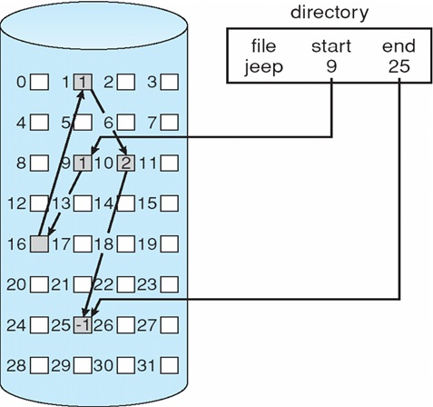
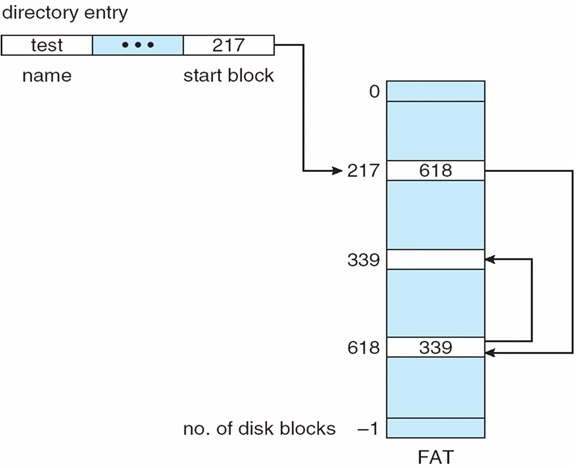
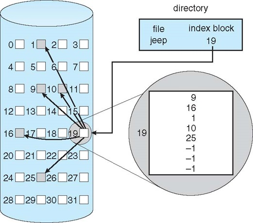

#File System Implementation

>เปิดวาป แนะนำให้อ่านที่นี่ https://github.com/pNagi/Lecture/blob/master/os/File-System%20Implementation.md

##Hard Disk
* เนื่องจา่ก Hard Disk มันใหญ่มาก ก็เลยต้องแบ่งเป็น Block เล็กๆ group ช่องเล็กๆ เข้าด้วยกัน จะได้จัดการไฟล์ จะได้ เข้าถึงที่อยู่ไฟล์ได้ง่าย
* ข้อดีของ Block คือทำให้พวก File System มีขนาดเล็กลง เพราะถ้าไม่แบ่ง block ก็จะทำให้ต้องมีตัวอ้างอิงไปยัง block ต่างๆถึงครึ่งนึงเลย
* ข้อเสีย คือ เราต้องใช้เป็นกลุ่ม ถ้าขนาดของข้อมูลที่เราจะเก็บมีขนาดเล็กกว่าขนาดของ Block ก็จะเสียพื้นที่ฟรี

##File System Structure

###File system
* ทำให้รู้ว่าไฟล์อยู่ตำแหน่งไหนบน Hard Disk
* **File System** อยู่บน Harddisk(secondary disk)
* ช่วยจัดการการแปลงข้อมูลฝั่ง Logical กับ Physical
* File System ช่วยในการเก็บและเรียกใช้ข้อมูลลง Disk ให้ง่ายขึ้น
* Disk ส่วนมากจะเก็บข้อมูลเป็น Block หรือ Sectors ซึ่งปกติขนาดจะประมาณ 512 bytes

###File control block
* เป็นตัวเก็บเกี่ยวกับรายละเอียดและโครงสร้างของไฟล์นั้นๆ
* จากภาพข้างล่างจะเห็นว่ามันจะเก็บ permissions, file dates, owner, size บลาๆๆ อีกมากมาย

###Device driver

* ก็คือ Driver อะนะ
* เป็นตัวจัดการฝั่ง Physical Device

##Layered File System

* เวลา File System มันทำงานมันจะทำงานต่อกันเป็นทอดๆ เป็น Layer ไป

###Logical File System
* เป็นตัวเก็บข้อมูลต่างๆเกี่ยวกับไฟล์ ทำหน้าที่เชื่อมระหว่าง Application Programs กับ OS
  * ตำแหน่งต่างๆของข้อมูล
  * เนื่องจากในบางครั้ง ผู้ใช้ อาจจะเห็นไฟล์แค่ 1 ไฟล์ แต่ในความเป็นจริงใน Harddisk อาจจะเก็บไว้แยกๆ กัน ตัวนี้จะเป็นตัวจัดการในเรื่องนี้
* ตัวอย่างใน ระบบ Unix คือ **inodes**

###File Organization Module
* เป็นตัวแปลงข้อมูลจาก Logical Block เป็น Physical Block
* คอยจัดการเรื่อง Free Space, Disk Allocation

###Basic File System
* เป็นตัวออกคำสั่ง Driver ให้ทำงาน
* ไอเหี้ยนี่เป็นตัวจัดการ cache กับ buffer อีกด้วย(allocation, freeing, replacement)
* เป็นตัวอ่านหรือเขียนข้อมูลในส่วน Physical Block

###I/O Control
* ประกอบด้วย Device Driver เป็นตัวออกคำสั่งให้ Device ทำงานได้
* เป็นตัวออกคำสั่งในส่วน **I/O Control** คอยสั่งการไปให้ Device นั้นๆทำงาน

##ตัวอย่าง File System
* **Windows** : FAT, FAT32, NTFS
* **Unix** : UFS, FFS
* **Linux** : ext2, ext3, ext4
* **อื่นๆ** : ZFS, GoogleFS, Oracle ASM, FUSE
ZFS - ใช้ใน Solari ของ SUN Java

##File-System Implementation
* การดำเนิกงานไฟล์ในระบบ แบ่งเป็น 2 อย่างคือ
  1. **On-disk Structure** เป็นการดำเนินงานของไฟล์ในระบบของ Disk
      - **Boot Control Block** - เก็บข้อมูลในการ Boot Windows / Bios จะเรียกที่ไหนใน hard disk ซึ่งในนี้จะเก็บ boots loader
      - **Volume Control Block** - Linux เรียก _Superblock_, Windows เรียก _Master File Table_ : เอาไว้เก็บข้อมูลของ Block เช่น มี Block ทั้งหมดกี่อัน, จำนวน Block ที่เหลือ, ขนาดของ Block, Block ที่ว่างอยู่
      - **Directory Structure** - โครงสร้างในการจัดกา Path ต่างๆของ File เพื่อลิ้งค์ไปยัง _FBC_
      - **FCB หรือ inodes** - เคยพูดถึงไปแล้ว เอาไว้เก็บรายละเอียดของไฟล์ / เป็นส่วนหนึ่งของ Volume Control Block
  2. **In-Memory Structure** เป็นการดำเนินงานของไฟล์ในระบบ Memory
  
      - **Mount Table** - ทำหน้าที่เก็บ Mount point ว่าอยู่ตรงไหน
        - Mount Point คือ /, /home, /usr, /var, /tmp คือ directory ที่เราสามารถเพิ่ม file system เข้าไปใน root file system ได้
        - Mount คือ partition ที่จะเอามาให้เห็นเป็น Drive
      - **Directory-structure cache** -
##Partitions and Mounting
* เรามี Hard Disk 1 ลุกอยากจะแบ่งไปใช้หลาย File System ก็เลยต้องแบ่ง Partition
* Root Partition - Partition ที่เอาไว้ลง OS สำหรับ boot
* เปิดคอมมา ก็ต้อง Mount root ก่อน เพราะเวลาปิดแต่ละครั้ง Mount root ก็จะหายไป แต่ส่วนมากก็จะเก็บ mount point เพื่อ boots OS ขึ้นมา
* การสร้าง Partition คือการสร้าง FCB, Boot Control Block, Volume Control Block ใหม่หลายๆชุด

##Directory
* Linear list - เก็บเป็นเหมือน Array ไว้เลย เวลาจะหาก็ต้อง Search ทั้งหมด มันช้า
* Hash table - เก็บเป็น Hash map ไว้ เวลาจะหาก็เข้าไปเปิดหา Hash นั้นๆ มันก็จะเจอทันที

##Extent-Based Systems
* แยกไฟล์เก็บเป็น Block ทีละ Block แต่จะเกิดปัญหาคือเกิน Fragmentation ก็จะแก้ปัญหาโดยการทำ Defragmentation เพื่อทำให้ไฟล์มันมาต่อกัน
* ไฟล์อาจจะแยกกัน กระจายกัน ถ้าทำ Defragmentation

###Linked Allocation
* ก็คือ เสียพื้นที่นิดนึงใน Block เพื่อทำเป็น pointer ในการ link ไปยัง block ต่อไปว่าตั้งอยู่ block ไหน

###File-Allocation Table
* คือไรไม่รู้

###Index Allocation
* เสียพื้นที่ 1 block เพื่อบอกว่าไฟล์แต่ละไฟล์ตั้งอยู่ใน block ไหนบ้าง

##Free-Space Management

ทีนี้จะเกิดปัญหาว่า จะรู้ได้ไงว่าจะวางไฟล์ไว้ไหน ก็ต้องเก็บไว้ว่าตรงไหนว่างบ้าง

###Bit vector or bit map
* ยอมเสีย 1 block เพื่อเก็บว่าช่องไหนว่างบ้าง โดย 1 คือว่าง 0 คือ ไม่ว่าง

###Linked list
* เนื่องจากช่องที่ว่างก็ไม่ได้ใช้อยู่แล้ว ก็เก็บเป็น link list เลย

**แบบไหนดีกว่ากัน?**

ในการเก็บข้อมูลควรจะเก็บติดๆกันเลย จะได้หาที่อยู่ที่ว่างติดๆกันได้ง่ายๆ แบบแรกจึงดีกว่าเพราะจะหาที่ว่างที่ติดๆกันได้ง่ายกว่า แบบ link list ที่ต้องหาแบบเยอะๆ ก่อน ถึงจะเจอที่ติดๆ กันให้พอใช้

##Read Ahead
* เป็นเทคนิคในการอ่านไฟล์ล่วงหน้า ถ้าเรารู้ว่าจะใช้ไฟล์ไหนในอนาคต เช่น เวลาเปิดเครื่องก็จะโหลด OS ไปเป็นไว้ใน Memory เลย โดยไม่ต้องมาอ่านไฟล์จาก Hard Disk อีกรอบ
* Free Behind คือคืนค่าที่ไม่ได้ใช้จาก Memory กลับไป

##Page Cache
* ก็เก็บไฟล์ที่ใช้บ่อยๆไว้ใน Cache เพื่อจะได้ไม่ต้องมาอ่านไฟล์จาก Hard Disk ทุกๆ ถ้าต้องการจะรู้ Block นั้นมีข้อมูลอะไรบ้าง

##Memory Mapped Page
* เราต้องยอมเสีย Memory ไปเลยเพื่อเก็บไฟล์ๆนึงไปเลย

##Recovery
* เวลาเปิดคอมมาใหม่มันจะทำการ Scan Disk
* ทำงานโดยที่ดูที่ Master File Table ว่าใน Link มันตรงกับไฟล์ที่เก็บไว้ใน Disk หรือเปล่า ถ้าไม่ตรงก็เอามาสร้างชื่อใหม่ใน Master File Table

##Log Structured File Systems
* Log structured (journaling)
* ระบบไฟล์สมัยนี้ใช้ Journal แล้ว หลักการคือ เก็บ Log ทุกการกระทำ
* ทุกการกระทำจะเก็บ ลง Journal ก่อน
* ถ้าเขียนลง Journal แล้วแต่ไฟดับ ยังไม่ทันจะทำงานที่ต้องการเลย Journal ก็จะค้างอยู่ยังไม่ทันลบ พอเปิดเครื่องมาใหม่ ก็จะทำตาม Journal ใหม่อีกรอบแล้ว ลบ Journal ทิ้ง
* ถ้าเขียนลง Journal แล้วไฟดับกลางทาง มันก็จะลบ Journal ทิ้งไปเลย เพราะ Journal เสีย
* ดังนั้นไฟล์จะไม่มีทางพัง ไม่มีทางเป็นครึ่งๆกลางๆ

##Virtual File System
* คือ จำลองไฟล์ธรรมดาเป็นระบบ File system ใหม่
* ทำให้ File System เป็น interface แล้วไปเขียนโปรแกรม implement คำสั่งพวกนี้
* เช่นการจำลองไฟล์ .iso เป็น ไดร์ฟใหม่ที่มี File System
