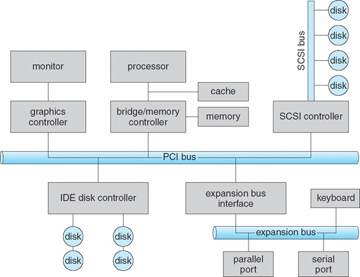
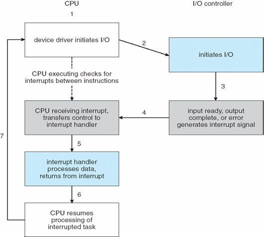
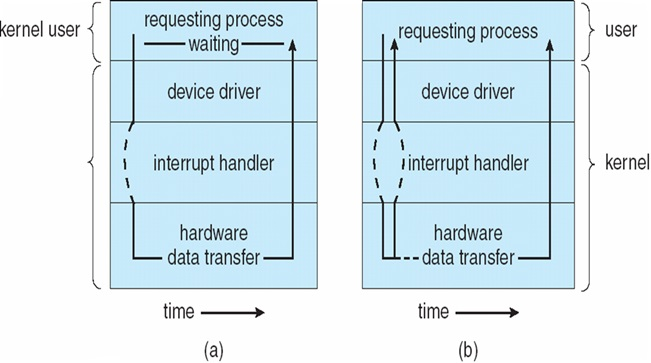

#I/O Systems

I/O ย่อมาจาก Input/Ouput คือรับค่าเข้ามาแล้วส่งออกไป
เช่น ใส่ Hard Disk ก็เป็น I/O

##Port
คือที่เราเสียบ I/O เข้าไป / port จะต่ออยู่บน Bus
* Port Serial
* Parallel port
* USB Port

##Bus
- **PCI Bus** เหมือนศูนย์กลาง ที่เชื่อมระบบต่างๆเข้าด้วยกัน
- Bus อื่นๆ Controller อาจจะต่อกับ Bus ของตัวเองได้

##Controller
การทำงานของ port แต่ละชนิดจะไม่เหมือนกัน เราก็ต้องมี Chip มา Control I/O แต่ละชนิด
* GPU (Controller การ์ดจอ)
* USB Controller
* SATA Controller

##Memory Mapped I/O
* ก็คือเอาข้อมูลเข้าไปพักไว้ใน memory แล้วให้ Device หรือ CPU เข้าไปดึงข้อมูลใน Memory โดยตรง ไม่จำเป็นต้องให้ CPU รับข้อมูลแล้วส่งไปให้แต่ละ Device

##Polling
* คือ Controller ที่ไม่มี Interrupts ก็ต้องให้ CPU ถามเอง
* CPU จะวนถาม Controller เรื่อยๆ ว่ามีอะไรเกิดขึ้นหรือเปล่า
* ถ้าเจอว่า Ready แล้วก็จะเก็บไว้เลยกว่าสามารถเข้าไปใช้งาน
* USB เป็น Polling หมดเลย

##Interrupts

* ก็คือมีการเข้าไปขัดจังหวะการทำงานของ CPU เวลาได้ข้อมูลมาแล้ว
* Mask คือ ให้ CPU ignore interrupts ได้
* นอกจากจะ interrupt จากอุปกรณ์ภายนอกได้ อุปกรณ์ภายใน CPU ก็สามารถสั่ง interrupt ได้ เช่น เขียน assembly ให้หารด้วย 0
* trap คือเอาไว้ catch exception จาก CPU ได้

##Direct Memory Access
* โดยปกติคือถ้าต้องการจะอ่าน ข้อมูลจาก Hard Disk ไปใส่ใน RAM CPU ก็จะถามข้อมูลจาก Hard Disk ไปเขียนใน RAM ทีละชุดๆ ทำให้เสียเวลาในการทำงานข้อ CPU
*
* ทำให้ Hard Disk สามารถส่งข้อมูลเข้าไปเขียนข้อมูลใน RAM ได้เลย โดยตรง แล้วค่อยไปบอก CPU รอบเดียวว่า Copy ข้อมูลเสร็จแล้ว

##Application I/O Interface

คือฝั่ง Application สร้างให้ I/O มองเห็นง่ายๆ ใช้งานง่ายๆ

การแบ่งรูปแบบของ Device

###ลักษณะการส่งข้อมูล
* Character-stream or block
  * Character - รับส่งข้อมูลทีละตัวอักษร เช่น Mouser
  * Block - รับส่งข้อมูลเป็นชุดๆ เช่น เครื่องอ่าน CD

###ลักษณะการเข้าถึงข้อมูล
* Sequential or random-access
  * Sequential - รับส่งข้อมูลเป็นลำดับ เช่น Modem
  * Random Access - เข้าถึงข้อมูลแบบสุ่ม เช่น Hard Disk

###ลักษณะการทำงาน
* Synchronous or asynchronous (or both)
 * เลื่อนลงไปอ่าน ข้างล่าง

###ลักษณะการเข้าไปใช้
* Sharable or dedicated
  * Sharable - Mouse / Keyboard คือมีหลาย process เข้าไปใช้งานได้พร้อมกัน
  * Dedicated - Modem คือยอมให้มี process ตัวเดียวเข้าไปใช้งานได้

###Device speed
* Speed of operation

###ทิศทางการส่งข้อมูล
* read-write, read only, or write only

##Characteristics of I/O Devices

###Nonblocking and Asynchronous I/O

ให้มองในระดับเขียนโปรแกรม

* Synchronous (blocking) (ภายซ้าย) คือ สั่งให้ Device ทำงานแล้วต้องรอการทำงานให้เสร็จก่อน  
* Asynchronous (non-blocking) (ภายขวา) คือ สั่งให้ Device ทำงานไม่จำเป็นต้องรอให้ทำงานเสร็จ ปล่อยให้ Device ทำงานไปเรื่อยๆแล้ว

##Kernel I/O Subsystem
* **Buffering**
  * buffer ส่วนมาก controller จะมี buffer ของตัวเอง
  * คือบางครั้งมีข้อมูลเยอะมากๆ แต่ส่งไม่ทันก็ต้องเอาไปพักเก็บไว้ใน Buffer ก่อน
  * ต่างกับ cache ตรงที่มันต่างกันคนละหน้าที่
* **Spooling**
  * concept เหมือน Buffer แต่มันจะใหญ่กว่า buffer
  * คือการที่เอาข้อมูลมาเก็บก่อน เพราะทำงานไม่ทัน
  * เช่น printer
* **I/O Protection**
  * เพื่อความ security ของระบบ OS ต้องระบุว่า Program ทั่วไป ห้ามเข้าไปใช้ I/O โดยตรง จะทำอะไรให้ทำผ่าน OS เท่านั้น
