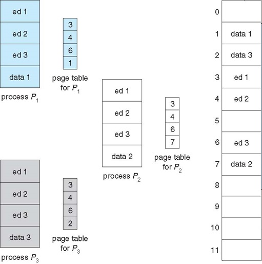
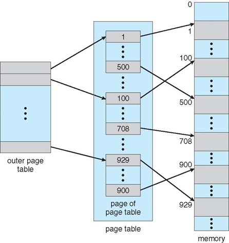
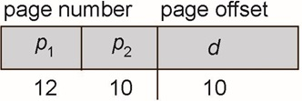
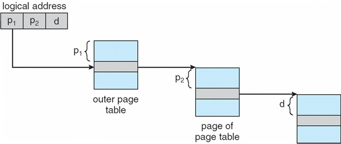
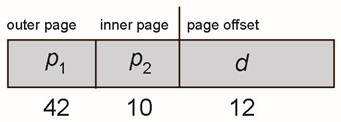
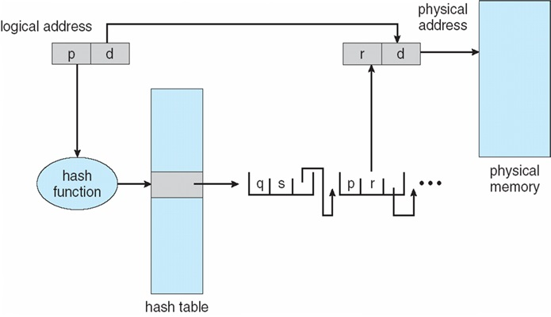
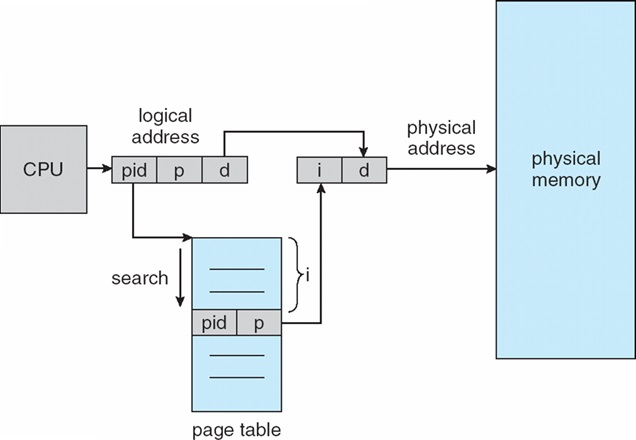

#Main Memory
##Memory Binding

* compile time คือ แปลงจากภาษาชั้นสูงเป็นภาษาเครื่อง ให้เครื่องทำงาน
* load time คือ ไว้จัดการ จัดตำแหน่งของ memory ให้กับ process

##Logical vs Physical Address
        CPU         =>          MMU             =>    Memory
    (logical)   4 (relocation register)     10    (Physical)

* ช่วงการแปลงจาก Logical ไป Physical เป็นช่วง Load Time ในช่วง Binding Address

##Dynamic relocation using a relocation register

* กระบวนการแปลง Logical address ไปเป็น physical address

##Dynamic Linking
* **routine** หมายถึงงาน อ้างถึงได้หลายอย่างตั้งแต่ Method, process บลาๆๆๆ
* **stub** คือตัวเก็บ address ของ routine เก่าๆ

เวลาจะเรียกใช้ Process ใหม่ๆ จะไปเช็คใน stub ก่อน ว่าเคยมีใน memory แล้วหรือยัง ถ้ามีแล้วจะไม่เรียกมาเก็บใน memory ใหม่ ก็ใช้ตัวเดิมไปเลย

**shared libraries** - คือ Dynamic เป็นการทำงานของ process พร้อมๆกันได้หลายๆอย่าง เลยมีการแชร์พวก library ใน RAM เพื่อถ้ามีใครจะใช้อีกก็ไม่ต้องไปโหลดจาก HDD มาใหม่

##Contiguous Allocation
* Process มันหั่นไม่ได้นะเพิ่ลลลลล
* การจัดสรรพื้นที่ให้ติดกัน
* คือการจัดให้ Process ใช้พื้นที่ว่างใน Memory ให้มันเต็มๆๆๆ จากข้างบนก่อน เพื่อจะได้เหลือพื้นที่ว่างอันใหญ่ๆ จะได้มีให้ใช้ Process อื่นได้ง่ายขึ้น ถ้าใช้มั่วๆ มันจะเหลือ space เล็กๆๆๆๆ เต็มเลย จะจัด Process ใหม่ได้ยาก
* ใช้ Process อย่างน้อย 2 อันถึงจะเรียกว่าติดกัน

##Multiple-partition allocation
* เท่าที่เข้าใจ ก็คือไอ Contiguous แต่เป็น Contiguous แบบมี Process มากมายมหาศาล =3=?

##Dynamic Storage-Allocation Problem
* วิธีว่าง Process ใน memory
  * First-fit - เจอช่องว่างพอก็ใส่เลย
  * Best-fit - ก็
  * Worst-fit -

##Fragmentation
1. **external** - มีพื้นที่ว่างเล็กๆจำนวนมาก ทำให้ใส่ Process ลงไปไม่ได้เลย ก็เลยต้อง compaction(บีบอัด) ให้เหลือที่เยอะๆ จะได้จัด Process ลงได้
2. **Internal** - Process จะใช้ Memory แค่ 10(Request) แต่ดันไปจอง 12 หรือ มากกว่า(Allocated Memory) ทำให้ใช้ Memory เปลือง ในแต่ละ Process ผิดพลาดน้อย แต่ ถ้าเกิดเยอะๆ จะทำให้เปลืองมาก

##Segmentation
* เป็น MMU ใช้ในการเปลี่ยน Logical ไป Physical โดยวิธี Segmentation
* การเปลี่ยนจาก Logical address ไป Physical Address ทำได้หลายวิธี

ต้องสร้าง segment table มาก่อนอันแรก เป็นตัวที่เปลี่ยน Logical เป็น Physical Memory  
**s/d** - แปลง Logical to Physical _s_ คือ segment number _d_ คือ offset 
**limit** - length of segment 
**d (offset)** - ขนาดของ process 
**Logical จะถูกแปลงที่ S/D แ้ลวจะเอามาเช็คก่อนว่าที่ว่างใน memory ว่างพอให้ใส่หรือเปล่า โดยตัว limit จะเป็น length ของช่องที่จะเอาไปใส่ ส่วน offset คือ length ของ process ที่จะใส่ในช่อง ถ้า offset น้อยกว่าก็จะใส่ลงไปใน memory ได้**

##Paging
* เป็น MMU อีกแบบนึง ในการเปลี่ยน Logical เป็น Physical

* page table เป็นตัวแปลง Logical เป็น Physical
* ถ้าเกิดเราเก็บข้อมูลแบบ Best-fit Worst-fit จะเกิด **External Fragmentation** ได้ วิธีนี้จะใช้แก้ปัญหาดังกล่าว
* **เพราะว่า Paging วิธีนี้จะทำให้ process ซอยแบ่งให้พอดีกับช่อง memory ได้ จะเก็บไว้ตรงไหนก็ได้ ตามภาพข้างล่าง**

##Paging with associative

* เนื่องจากไอวิธี paging ธรรมดามันช้ามากๆๆๆๆๆ ก็เลยต้องหาอะไรมาเก็บคล้ายๆ cache ชื่อ Associative Memory หรือ translation look-aside buffers (TLBs)
* ถ้า page ต้องการ physical memory ที่มีอยู่ใน TLBs อยู่แล้ว ก็ไม่ต้องเสียเวลาแปลงจาก Logical เป็น Physical แต่จะใช้ Physical ที่มีอยู่ใน TLBs เลย ถ้าเจอจะเรียก TLB hit ถ้าไม่เจอ TLB miss

##EAT(Effective Access Time)
* Hit ratio(alpha) - อัตราการเจอใน TLB
* Associative Lookup 
EAT = เจอใน TLB + ไม่เจอใน TLB
### Example
alpha = 80%, Associative Lookup = 20ns for TLB search, 100 ns for memory access 
EAT = (80/100 x 100) + (20/100x100 + 100) 
EAT = 200 ns 

##Memory Protection
* ใน page table จะมี 2 ค่าที่คอยบอกสถานะ
* valid - ในส่วนนั้นสามารถใช้งานได้
* invalid - ไม่สามารถในส่วนนั้นได้
* valid-invalid bit เอาไว้บอกว่าจะเก็บลงใน frame ได้หรือไม่ได้

##Shared Pages

* process ส่วนไหนที่ทำงานเหมือนกันก็จะแชร์ page เลย ใช้ physical memory ส่วนเดียวกันเลย

##Hierarchical Page Tables
###Two-Level Page-Table Scheme

* คือถ้ามี process เยอะสัสๆ index ก็จะยาวไปเรื่อยยๆๆๆๆๆๆ ก็เลยต้องซอยย่อยๆ เพื่อไม่ให้ index มันยาวโคตรๆ จัดเป็นหมวดหมู่ๆไป เหมือน หนังสือถ้ามี 400 บท แต่ถ้าย่อย 400 บทเป็น 10 ตอน ก็จะเหลือแต่ละตอนแค่ 40 บท ทำให้มันง่ายในการ access ค่า
* รูปแบบของ Logical Address แบบใหม่

##Hash Page Table

* เอา logical address มาใส่ hash fn แล้วเชื่อมไปยัง hash นั้นๆใน table สิ่งที่ได้ออกมาใน table จะเชื่อมเป็น link list กับ physical address ใน memory อยู่แล้ว

##Inverted Page

* จะใช้ pid ในการหา p (physical address)
* ช้ามากในการหา pid
* แต่จะประหยัด memory มากๆ
