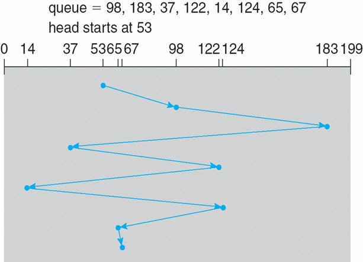
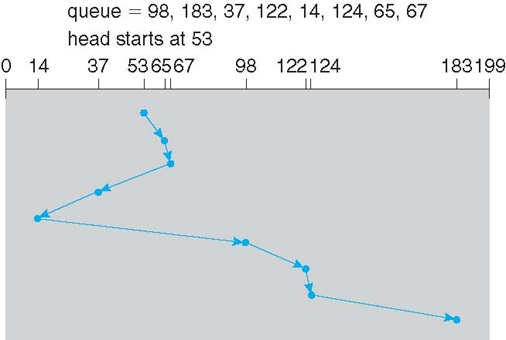
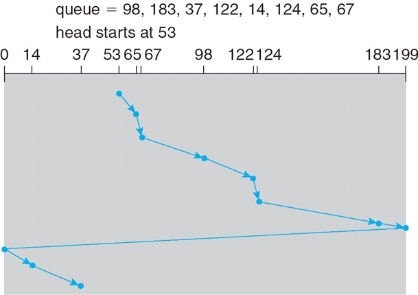
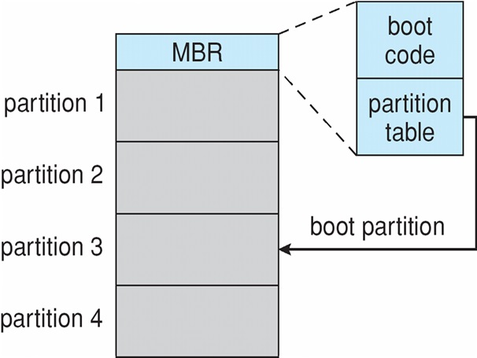

#Mass-Storage Systems
##Overview of Mass Storage Structure

* Platter - จานหมุน
* Track - ลำดับชั้น
* Sectors - ช่องย่อยๆใน Track
* Magnetic Disk (ดิสก์) เอาไว้เก็บข้อมูล
	- **Transfer Rate** - rate ในการถ่ายโอนข้อมูลจาก disk หน่วย _**megabit per second**_
	- **Positioning Time (Random access time)** - เวลาในการขยับหัวอ่านไปยังร่อง_(seek time)_ + เวลาเริ่มต้นในการหา sectors_(rotational latency)_ _ดิสก์ต้องเข้าถึงข้อมูลโดยตรงและแบบสุ่มได้ (direct-access storage device:DASD)_
	- **Head cash** - หัวอ่านมันพัง
	- **Disk cash** - จากพัง
* ต่อกับตัวเครื่องด้วย **I/O Bus**
	- SATA, USB, Fibre Channel, SCSI

##Hard Disks
มาตรฐานเค้าบอกว่า ...
* ทางทฤษฎี **Transfer Rate** => 6 Gb/sec
* แต่เอาจริงๆ **Transfer Rate** => 1 Gb/sec
* **Seek Time** ควรอยู่ที่ 3ms to 12ms _Avg: 1/3 of tracks_
* จะหา **Latency** ได้จาก
	- 60/RPM(Spindle)
* **Average Latency** = 1/2*latency
 
###Hard Disks Performance
* **Access Latency** = Average Access Time = avg(Seek Time) + avg(Latency)
* **Average I/O Time** = Average Access Time + (data/tranfer rate) + controller overhead
####Example
- Data size : **4KB** block on a 7200 RPM disk
- Avg seek time : **5 ms**
- Transfer rate : **1Gb/sec**
- Controller Overhead : **0.1 ms** 
	_Find I/O Time?_

	**I/O Time** = Average Access Time + Transfer Time + controller overhead 
	**Transfer Time** _แปลงหน่วย_ 
	= 4KB/(1Gb/s) to ms  
	= 4KBs/1Gb x 8b/1B 	**(8b/1B = 1)** 
	= 32Ks/G x 1GB/2^20 KB **(1GB = 2^20 KB)**  
	= 32/2^20 s 
	= 0.031 ms 

	**Average Access Time** = avg(Seek Time) + avg(Latency) 
	avg(Seek Time) = 5ms 
	avg(Latency) = (60/7200) x 1000 x 1/2 ms = 4.17 ms **(x1000 เพื่อแปลงหน่วยให้เป็น m)** 
	Avg Access Time = 5ms + 4.17ms = 9.17ms

	**I/O Time** = 9.17ms + 0.031ms + 0.1ms = 9.301 ms #

	**ทำไงให้ดีขึ้น** : สิ่งที่เสียเวลามากที่สุดคือ Access Time ดังนั้นควรจะหาวิธีลดเวลา Access Time ลง

##SSD(Solid-State Disks)
* ไวกว่า (แต่ยิ่งนานยิ่งช้า เพราะมันพัง)
* ไม่มีส่วนที่ต้องหมุนแล้ว ก็เลยไม่มี Seek Time & Latency
* พื้นที่ใช้สอยน้อย
* SSD ถ้ามีการเขียนข้อมูลบ่อยๆ จะพังไว
* ราคาต่อ MB แพงงงงง

##Magnetic Tape
* เกิดไม่ทัน ไม่รู้จัก .. .
* ช้าาาาา เพราะแม่งต้องหมุนเทปทั้งม้วน
* แต่เก็บได้นานถ้ารักษาสภาพที่เก็บดีๆ

##Disk Structure
* ช่องเล็กที่สุดใน Disk คือ **Logical Block**

##Storage Area Network VS Network Attached Storage

###NAS
* มี Storage อยู่ 1 ตัว แชร์ให้ใครใช้ก็ได้ในระบบ Network เดียวกัน
* แก้ปัญหาแบบปกติที่เราจะแชร์ไฟล์ทีต้องอัพขึ้น Dropbox หรือ แนบไฟล์ Email

###SAN
* มีระบบ Storage เยอะแยะมากมายไว้เก็บข้อมูล แต่**แยกกับระบบ network ไม่ได้ต่อกับบ network โดยตรง**
* เนื่องจากระบบไม่ได้ผ่านระบบ network ดังนั้นการส่งข้อมูลภายใน storage จึงไม่ส่งผลกระทบต่อระบบ network
* **เป็นระบบที่มีความยืดหยุ่น**

##Disk Scheduling
* OS เป็นคนทำ Disk Scheduling
* ทำเพื่อให้หัวอ่านขยับน้อยที่สุด จะได้ลด Seek Time
* มีหลายวิธีในการทำ Disk Scheduling
### FCFS - First Come First Search

### SSTF - Shortest Seek Time First selects

### SCAN - อ่านไปทีละ Track ไปทีละด้าน และ มีการย้อนกลับ

### C-SCAN - หมุนไปเรื่อยๆ ไม่มีหมุนกลับ พอสุดทางก็ให้กลับมาที่เริ่มต้นใหม่

### C-Look - ขึ้นไปบนสุด แล้วไม่ไปต่อแล้ว ลงกลับมาหาตัวต่ำสุดเลย

* ดีที่สุด SSTF
* ส่วน Scan C-Scan จะเหมาะกับการอ่านข้อมูลหรือเขียนข้อมูลเยอะๆ
* Disk สามารถเลือกได้ว่าจะใช้แบบไหนในการทำงาน

##Disk Management
* **Partition**

##RAID
* RAID คือ เอา Disk หลายๆตัวมาทำงานร่วมกัน
	* RAID0 คือ ต่อเชื่อมความเร็ว ทำให้ Disk ทำงานไวขึ้นเพราะไฟล์จะถูกแบ่งออกตามจำนวนคู่ Harddisk
	* RAID1 คือ ต่อเชื่อมเพื่อนความปลอดภัย เพราะ Disk คู่ของมันจะทำตามทุกอย่างของ Disk อีกตัวหนึ่ง
	* RAID1+0 คือ RAID1 จะอยู่ข้างใน RAID0
	
	* RAID0+1 คือ RAID0 จะอยู่ใน RAID1
	
