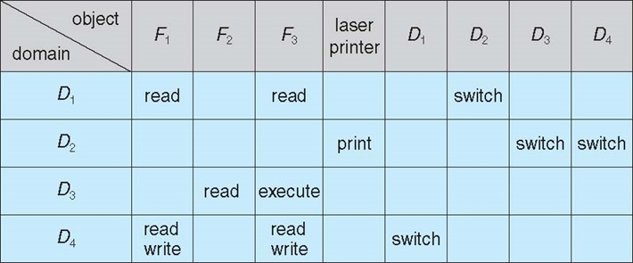

#Protection
##Principles of Protection
* การป้องกันด้านความปลอดภัย
* **privileges** - permission เป็นสิทธิ์ในการทำอะไรสักอย่างใน OS
* process / user / program / system / procedure / อะไรก็ตามที่ออกคำสั่งได้ เรียก รวมๆว่า **Domain**
* **แต่ละ Domain จะมี privileges ต่างกัน**
* _ใน 1 OS ควรจะกระจายระดับ privileges ไม่ควร รวมเอาไว้ใน 1 Domain_
* จะจำกัดผลกระทบได้ หากมี Domain ใด โดน Hack
* การที่แยก privileges ทำให้สามารถกระจายหน้าที่ได้ดี

##Grain
* ให้สิทธิ์ในการทำอะไรสักอย่าง / **privilege management**

###Rough-grained  
* ให้ Privileges มารวมๆ เป็นชิ้นใหญ่ๆ มีสิทธิ์มากมายหลายอย่าง - เหมือนการให้กุญแจบ้านทั้งหลังไปกับ 1 คน
* employee - open door

###Fine-grained  
* ให้ Privileges แบบละเอียดๆ - เหมือนการให้กุญแจบ้านแบ่งเป็นห้องๆ
* employee - office hour
  * ACL, RBAC

##Domain Structure
* Access-right ความสามารถในการเข้าถึงต่างๆ
* Domain - set of access right

##Domain Implementation (UNIX)
###Domain switch
* การเปลี่ยน Domain เพื่อเข้าไปใช้งานในสิทธิ์ของอีก Domain นึง แบบชั่วคราว
* เมื่อทำงานเสร็จคำสั่งก็จะกลับไปเป็น Domain ตัวเดิม
* คำสั่ง su - ไปใช้ root คือจะ switch ไปใช้ user นั้นเลย จนกว่าจะใช้คำสั่ง exit ถึงจะออกจาก user นั้น
* คำสั่ง sudo - ไปใช้ root คือจะ switch ไปใช้ user นั้นแค่เฉพาะคำสั่งนั้นๆเท่านั้น
* ทั้งสองตัวจะต้อง login password ทั้งคู่ ถ้า user นั้นๆ มี รหัสผ่าน
##Domain Implementation (MULTICS)

* วงใหญ่กว่าจะมีสิทธิ์มากกว่าวงที่เล็กกว่า

##Access Matrix

###Access Matrix of Figure A with Domains as Objects

* คือ Matrix ที่กำหนดว่า User ไหนสามารถ Switch ไป Domain ไหนได้บ้าง

###Access Matrix With Owner Rights

* Owner สามารถเข้าไปจัดการสิทธิ์ของทุกคนสำหรับไฟล์ๆนั้นได้

###Access Matrix with Copy Rights

* Domain ไหนที่มี * สามารถ copy สิทธิ์ไปให้ Domain อันไหนก็ได้

###Modified Access Matrix of Figure B

* Control - Domain ไหนที่เป็น Control กับอีก Domain นึงจะสามารถเข้าไปจัดการ Privilege ของอีก Domain ได้

##Implementation of Access Matrix
* Access List = (domain, right-set)
* Capability List = (object, right-set)

###Option 1 – Global table
* (domain, object, right-set)
* เป็นเหมือนตารางไปเรื่อยๆ ซึ่งเวลาเพิ่มก็จะเพิ่มเข้าไปเรื่อยๆ
* มันง่ายมากที่จะใช้
* แต่จะยากมากเวลาจะหา เพราะว่าต้องเข้าไปหาในตารางอันใหญ่ๆ
* เหมือนต้องวน For หลายๆรอบเพื่อหาว่า Domain ไหน จะเข้าไปใช้ Object ไหน แล้วมีสิทธิ์ทำอะไรบ้าง (right-set)

###Option 2 – Access lists for objects
* (domain, right-set)
* วิธีนี้จะเก็บ privilege ไว้ที่ไฟล์แทนที่จะเก็บไว้แบบ global table
* เวลาจะใช้งาน Domain จะเรียก Object ใน Object ก็จะเช็คใน Access List ของตัวเองว่า Domain นี้เข้าไปใช้งานตัวมันได้หรือไม่
* ข้อดีคือ เวลาเราสร้าง Object มาก็จะกำหนดได้เลย ว่า จะให้ใครเข้าไปใช้งานมันได้หรือไม่

###Option 3 – Capability list for domains
* Domain เป้นคนเก็บ privilege list แทน
* มันจะแปลกตรงที่ว่า Domain จะเข้าไปยุ่งกับ privilege นี้ไม่ได้
* เวลา Domain จะเข้าไปเปิด object ใด ก็จะมี point เชื่อมระหว่าง Object กับ privilege ของ Domain ได้ แล้วเข้ามาดูว่าใน Domain นั้นมีสิทธิ์หรือเปล่า
* ข้อเสียคือ เวลาเราสร้าง Object ใหม่ มันจะลำบากเวลาเพิ่มเข้าไปใน Domain ต่างๆทุกอัน
* Revoke เวลาจะลบ access พวกนี้ มันจะลำบากเพราะต้องไปหาในทุกๆ Domain

###Option 4 – Lock-key
* เก็บทั้งแบบ Access List และ capability List
* Object จะเก็บ locks
* Domain จะเก็บ keys
* เวลาจะใช้งานกันถ้า เอา locks กับ keys มา match กันรู้ทันทีว่าเข้ามาใช้งานได้หรือเปล่า

##Comparison of Implementations

###Global
* **ข้อดี** - ง่าย
* **ข้อเสีย** - ใช้แรมมาก, ช้า

###Access List
* **ข้อดี** - เวลาจะสร้าง object ขึ้นมาใหม่ มันจะสร้างง่ายมาก
* **ข้อเสีย** - มันลำบากเวลาจะจัดการกับ privilege เพราะมันเก็บไว้ในไฟล์ แล้วไฟล์มีจำนวนเยอะมาก, ต้องเช็คก่อนว่าใครเป็นคนเข้ามาถึงจะเอาไปเช็คได้ว่าใครเป็นคน Access

###Capability
* **ข้อดี** - เราจะรุ้ชัดเจนว่า Domain ไหนสามารถทำอะไรได้บ้างอย่างรวดเร็ว
* **ข้อเสีย** - มันยุ่งยากเพราะมันเชื่อม Domain กับ Object มั่วไปหมด, ทำให้มัน revoke ลำบาก

###Lock-Key
* **ข้อดี** - แก้ข้อเสียของทั้ง Access List กับ capability หมดแล้ว เพราะมันเอามารวมกัน, Effective, Flexible, Revoke ง่าย

##Access Control

* เป็นตัว Control การเข้าถึง Object ต่างๆ ซึ่งต้องใช้ Access control matrix ในการกำหนด privilege ต่างๆ
* RBAC- role-base access control
* Domain จะเก็บ role แต่ละอันเอาไว้ แล้วเวลาจะเข้าไปใน object ก็ได้ดูได้ว่า Domain นั้นๆมีสิทธิ์อะไรบ้าง

##Revoke
* Revoke มีทั้งหมด 4 แบบ
  * Immediate VS Delayed
  * Selective VS General
  * Partial VS Total
  * Temporary VS Permanent

###Immediate VS Delayed
* ลบแล้วหายทันที กับ ลบแล้วดีเลย์

###Selective VS General
* ลบแล้วเลือกเฉพาะบาง User กับ ลบแล้วหายหมดเลย

###Partial VS Total
* ลบได้แบบเฉพาะบางส่วน กับ ลบแล้วหายหมดเลย

###Temporary VS Permanent
* ลบเป้น Temp กับลบแล้วหายถาวร

ซึ่งถ้าดูแต่ละแบบก้จะได้ประมาณนี้

####Access List
* Immediate, general or selective, total or partial, permanent or temporary

####Capability List
* Back-pointers มี pointer เชื่อมกันระหว่าง Domain กับ Object
* Indirection
* Key
  * Master Key - เวลาสร้าง object ก็จะสร้าง Key ขึ้นมาใหม่ (object, right-set) --- Obejct(Master Key)

## ตัวอย่าง
###Hydra System
* เป็นอะไรสักอย่างที่ใช้ capability list
* ส่วนใหญ่จะใช้ Lock Key

###Cambridge CAP System
* Data capability 
