#Virtual Memory

Memory ส่วนไหนที่ไม่ได้ใช้ก็จะเอาไปเก็บใน Hard Disk ก่อน พอจะใช้ก็เอากลับมาเก็บใน Memory ใหม่ ทำให้การใช้งาน Memory มีประสิทธิภาพมากขึ้นโดยอันไหนที่ไม่จำเป็นก็เอาไปเก็บใน Hard Disk ก่อน

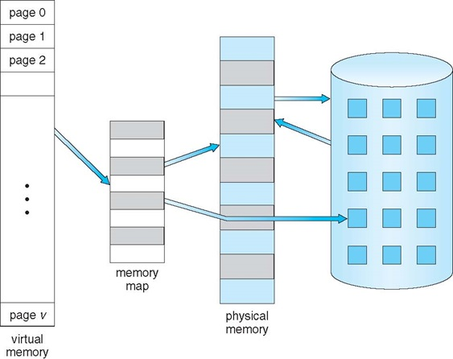

**Background**
* ควรจะเพิ่มปริมาณการเก็บได้ไม่จำกัด
* เนื่องจากมีหลายๆส่วนของโปรแกรม ไม่จำเป็นต้องใช้เลย อย่างเช่น ส่วนของการตรวจสอบข้อผิดพลาด ถ้าเราเอาไปเก็บไว้ใน VM ก็จะได้ไม่เปลือง Main memory

**Virtual-address Space**
* ใน Virtual ก็จะมี Address ของตัวเองขึ้นมาเพื่อใช้ในการอ้างอิง

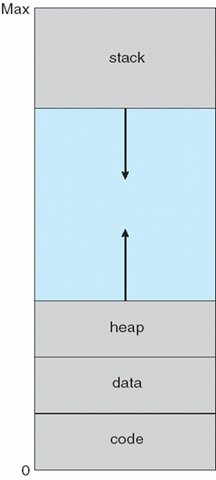

##Demand Paging
* การดึงเอา page ที่จำเป็นต้องใช้มาเก็บไว้ใน memory เท่านั้น อันไหนที่ไม่จำเป็นต้องใช้ก็เอาไปเก็บไว้ใน VM
* คือปกติ 1 process มันจะมีหลาย page ตามการทำงานของมัน page ไหนที่ไม่จำเป็นก็เอาออกไปไว้ใน VM จะได้ไม่เปลือง Main Memory ส่วนอันไหนจำเป็นก็ทำต่อไปใน Main memory

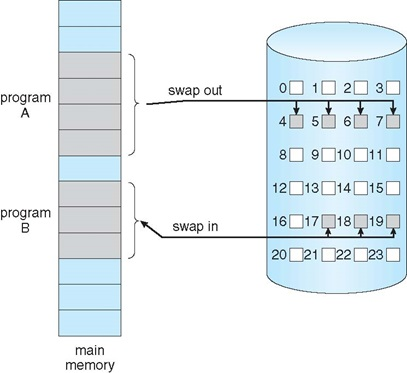

* Lazy swapper - swap page ไปมาเมื่อต้องการที่จะใช้
* Page Fault - ก็คือยังไม่มีใน Frame ก็เลยไปดึงมาจาก Virtual เพื่อเอามาเก็บใน Frame แล้วเปลี่ยนเป็น Valid

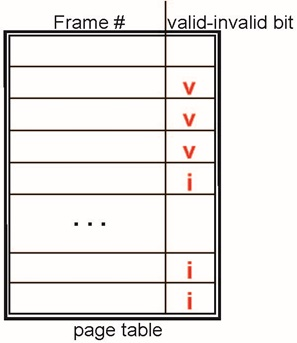  

* จากภาพข้างบน Page Table เป็นตัวเดียวกับในเรื่อง main memory แต่จะเพิ่มการแจ้งค่า valid-invalid bit ขึ้นมาด้วย
* valid-invalid bit จะเอาไว้บอกว่าตอนนี้ page ของ process อยู่ใน main memory แล้วหรือยัง ถ้ามีแล้วก็ valid ถ้ายังไม่มีก็ invalid

##Page Fault
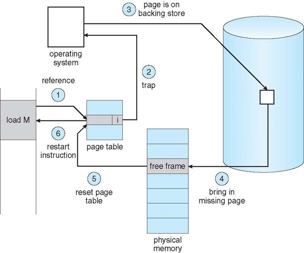
* Page Fault - เวลาที่ OS ต้องเข้าถึงข้อมูลใน Memory แต่ยังไม่ถูกย้ายมายัง Main Memory เรียกว่า page fault
* ซึ่งใน VM เมื่อระบบพบ page fault ก็จะไปหาใน Virtual Memory แล้วย้ายมาเก็บไว้ใน Main Memory
* ซึ่งกระบววนการย้ายก็จะเป็นไปตามภาพข้างบน

##Aspects of Demand Paging
* เคสแย่สุด
  * ทุก page ของ process นั้นไม่มีใน main memory เลย
  * ทุก page ก็ต้องเข้าไป access เจอ page fault แล้วก็ต้องไปดึงจาก VM ทุกๆตัว
  * Pure demand paging

##Page Fault Rate
* มีค่าตั้งแต่ 0 ... 1
* EAT = hit + miss
* EAT = (1-p) x time + p x time

##Copy-on-Write
* เก็บ Free Frame ไว้ใน pool ชื่อ zero-fill-on-demand เพื่อเวลาจะใช้ก็หยิบมาใช้ได้เลย

การแชร์ p1 กับ p2 อะไรที่ใช้ร่วมกันก็จะแชร์ไปใช้อันเดียวกัน

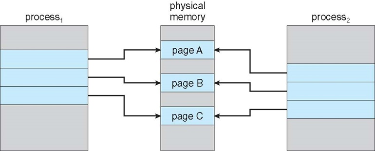

คือถ้ามี p1 ต้องการจะแก้ page C มันเลยต้องสร้าง page ใหม่ขึ้นมาแล้วค่อยเข้าไปแก้ในนั้น (Copy on Write)

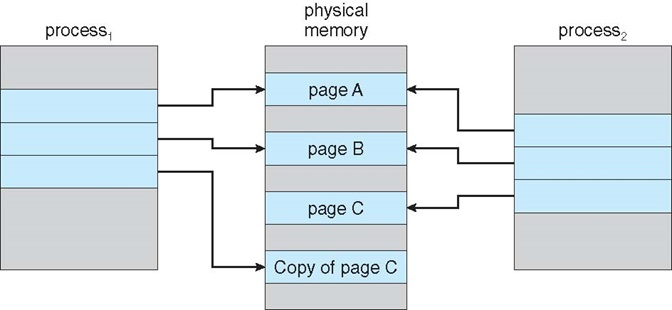

##จะเกิดอะไรขึ้นถ้าใน main memory ไม่มีที่ว่างเลย?
* ก็ต้องหาวิธีเอาบาง page ใน main memory swap ไปเก็บใน VM แทน เพื่อให้ main memory มีที่ว่างสำหรับ page ใหม่(page replacement)

###Page Replacement
* ป้องกันการแบ่ง page ที่มันเวอร์เกินไป เช่น ต้องการ 1 ให้ไป 300
* ป้องกันการ swap page ที่มากจนเกินไป

###Basic Page Replacement

ถ้าจะ Replacement ต้องทำไง?
1. หา Free Frame
  - ถ้ามี ก็ใช้งานเลย
  - ถ้าไม่มีก็ต้องไปหา Frame อื่นแทนที่ เรียก Frame นั้นว่า victim Frame
    - ก็เอา victim ไปเขียนใน disk
2. เอา page ที่จะใช้ มาเขียนแทน victim frame
3. ก็ทำงาน process อีกรอบ

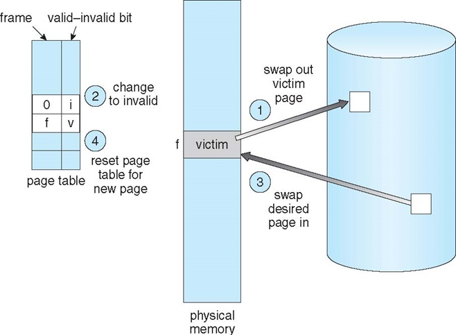

ทีนี้การที่จะเลือก victim frame จะใช้ algorithm ไหนในการเลือก?

###1.Page and Frame Replacement Algorithms

ต้องคำนึงถึงอะไรบ้าง?

1. Frame-allocation algorithm
  - ต้องใช้ frame กี่ frame สำหรับ process นั้นๆ
  - แล้วจะใช้ frame ไหนใน การ replace
2. Page-replacement algorithm

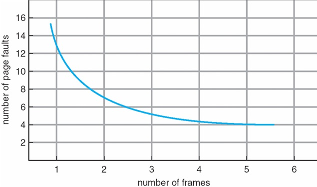

ในทางทฤษฎี ควรจะเป็นตามกราฟนี้ ยิ่ง frame เยอะ page fault ควรจะลดลง

###2.First-In-First-Out (FIFO) Algorithm
คือ page ไหนมาก่อน ก็ออกก่อนในกรณีที่ไม่เหลือ free frame แล้ว

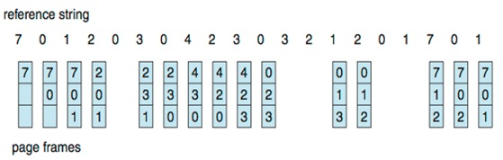

จากภาพ ในขั้นที่ 3 มี 7 0 1 แต่พอต้องการจะใส่ 2 main memory เต็มแล้ว เลยต้องใส่ 2 ลงไปแทนที่ 7 เพราะ 7 มาก่อน

แต่ว่าแบบนี้มันเหี้ย ไม่ได้ช่วยให้มันดีขึ้นเลย

Belady's Anomaly - กรณีของการที่เพิ่ม Frame แล้ว Page Fault เจือกเพิ่มขึ้น

###3.Optimal Algorithm

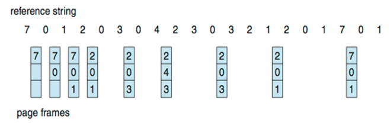

แบบนี้คือทำนายว่า page ไหน ไม่น่าจะโดนใช้ในอนาคต

แต่!!! เราจะรู้ได้ไงว่ามันจะไม่ถูกใช้ในอนาคต

###4.Least Recently Used (LRU) Algorithm

คราวนี้เอาใหม่ ทำนายจากอดีต อะไรที่ไม่ได้ใช้งานมานานที่สุดก็เอาอันนั้นออกไป

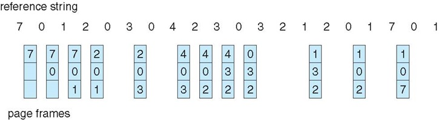

จากภาพ ตอนที่ 4 จะเพิ่ม 2 เข้ามา แต่มันเต็ม ก็เลยต้องเลือก 7 เพราะ 7 มันใช้งานเมื่อนานสุดมากแล้ววว

####มันมีวิธีทำให้ LRU มันไวขึ้นอีกกกก

ใช้ Stack

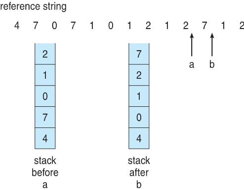

page อันไหนใช้งานบ่อยๆก็จะยกขึ้นไปข้างบน แสดงว่าถ้าใช้อันไหนบ่อยๆก็จะอยู่บนๆ อันไหนไม่ค่อยได้ใช้ก็จะอยู่ข้างล่าง

**ซึ่ง ทุก Algorithm ที่พูดมาอะ มันก็ได้แค่ทำนายอะนะ ไม่ได้ตรงตามสิ่งที่ควรจะเป็นเท่าไหร่** มันมีวิธีที่ดีกว่านั้นอีกเช่น Database

##Allocation of Frames
วิธีแจกจ่าย frame ให้ page ต่างๆ

แบ่งเป็น 2 ประเภท
1. Fixed Allocation - ก็คือแจก Frame ให้แบบกำกัด
  - Equal allocation - แจก Frame ให้เท่าๆกันหมดเลย ทุกๆ process กำหนดมาแน่นอน
  - Proportional allocation - แจก Frame โดยแบางให้มันเท่าๆกันตามสัดส่วน
    - เช่น process A จะใช้ 8 page process B จะใช้ 5 page มี frame ทั้งหมด 50 frame
    - วิธีนี้ก็จะเอา 8/13*50 = 31 process A ก็จะได้ไป 31 frame ส่วน B จะได้ 5/13*50 = 20 frame
2. Priority Allocation - แบ่งตาม priority
  - ถ้า process ไหนมี priority มากกว่าก็จะตัดเอา page ของ process ที่ priority น้อยออกไป

##Global vs Local Allocation
###Global replacement

* คือ ปล่อย Frame แบบ Global เวลา process ไหนจะขอเพิ่มแต่ไม่มี free frame ก็จะเข้าถึงทุก frame ในแบบ global เลยก็สามารถลบทุก frame ได้เลย
* แบบนี้มันไม่ดี เพราะว่า process จะเข้าไป swap process อื่นกันได้มั่วไปหมด ทำให้เกิดการ swap ที่มาจนเกินไป / process ยุ่งในการ swap กันมากๆ จนไม่ได้ทำอย่างอื่นเลยเรียก Thrashing
* ไม่ต้องกังวลเรื่อง limit

###Local replacement

* ก็ทับได้แค่ใน process ของตัวเองไปกินของตัวอื่นไม่ได้
* ข้อดี คือ ไม่ต้องกังวลการมั่วกันในการ swap
* ข้อเสีย คือ ต้องกังวลเรื่อง limit

##Non-Uniform Memory Access(NUMA)
* ความเร็วในการ access เข้าไปใช้ memory มันไม่เท่ากัน
* แก้โดยการ group RAM แล้วก็เลือกใช้อันที่มันไวกว่ากันก่อน

###Thrashing
* process ยุ่งในการ swap จนไม่ได้ทำอย่างเลย
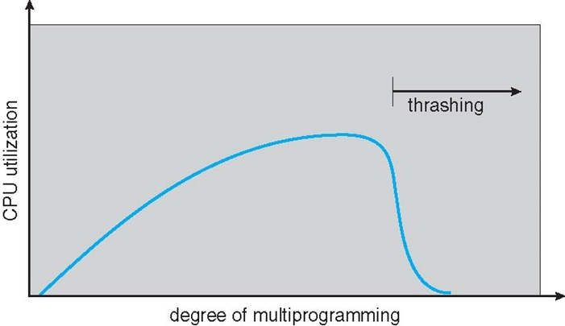
* **cpu utilization** เราสามารถตรวจสอบ Thrashing ได้จากการดู cpu utilization โดยถ้าการใช้ cpu ลดลง ก็แสดงว่า process มันติดมัวแต่ swap กันไปกันมา ไม่ได้ทำงานสักที

###Working-Set Model
* เป็นวิธีลด Page fault
* จำนวนของ page ที่ใช้อยู่ในช่วงเวลาหนึ่ง ซึ่งจะมีจำนวนมากน้อยก็ขึ้นอยู่กับ เวลาของ Set
* Working set model คือ page ที่ใช้งานก็จะเก็บไว้ใน set เพื่อดูว่า page ไหนใช้งานในช่วงเวลานั้นๆ ถ้า page ไหนที่ไม่อยู่ใน set ก็มีโอกาสที่จะถูก Free Frame ออกไป

##Page-Fault Frequency
ถ้าเกิด Page Fault เยอะก็จะเกิด Thrashing

##Working Sets and Page Fault Rates
คราวนี้มาดูว่า Working set จะเอาไปทำอะไร
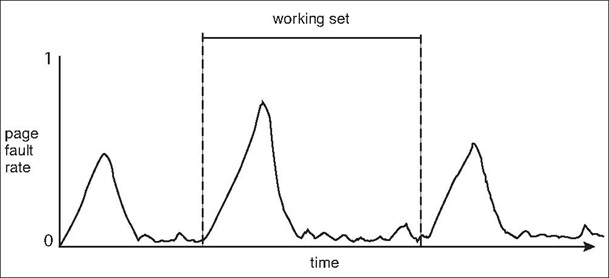
###Prepaging จะลด Page Fault ได้ยังไงบ้าง?
1. Page Size - ลด page size ทำให้ frame มันเยอะขึ้นกว่าเดิม
2. TLB - เหมือนในเรื่อง main memory เป็น cache ที่มาช่วยเก็บ page ที่ใช้บ่อยๆอีกที / ใน TLB ในทางนิยามมันคือตัวเดียวกับ working set ซึ่งถ้ามีขนาดใหญ่ขึ้นก็จะทำให้เห็น page เยอะขึ้น
3. Program Structure - ในบางครั้งเราสามารถลด page fault ได้จากการเขียนโปรแกรมให้ดี
4. I/O interlock - การจอง memory ให้ page เลย จองไว้ตลอดเลย แต่มีข้อเสียถ้าจองเยอะๆ มันจะเต็มได้

##จากคลิป
when write file the data goes user->kernel->device

user->kernel can be slow 2 reasons
  1. its slow because kernel space and user space have different protection mode. To transfer data, or cross the protection boundary, the memory differences between the two has to be resolve.
  2. There is ocillary micro?(idk) and certain function call that linux has to use to copy the data back and forth between kernel and user.
